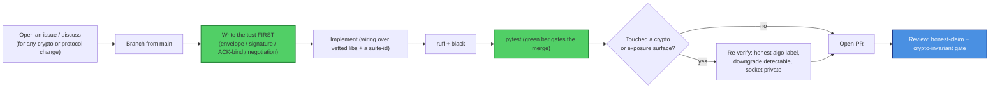

# Contributing to skcomms

Thanks for helping with `skcomms` — the **sovereign realm-aware comms protocol** of
SKWorld (FQID-addressed, PGP/PQC-signed Envelope v1 → transport router → SKFed S2S
federation). This is a **cryptographic confidentiality + authenticity** surface the whole
stack trusts, so the bar is higher than a typical package: the honest-claim rules are
**non-negotiable** and the crypto invariants are gated.

By participating you agree to the [Code of Conduct](CODE_OF_CONDUCT.md). All
contributions are licensed under **GPL-3.0-or-later** (this repo's recorded license — not
relicensed).

---

## Ground rules (read before you write code)

From the sk-standards
[CRYPTOGRAPHY_STANDARD](https://github.com/smilinTux/sk-standards/blob/main/standards/CRYPTOGRAPHY_STANDARD.md)
and [CRYPTO_AGILITY_STANDARD](https://github.com/smilinTux/sk-standards/blob/main/standards/CRYPTO_AGILITY_STANDARD.md),
enforced in review:

1. **We bind vetted crypto; we never hand-roll primitives.** OpenPGP / lattice / curve /
   KDF math comes from **PGPy**, **`cryptography`**, and **liboqs (`oqs`)**. Do not
   hand-roll signatures, KEMs, curves, or the combiner.
2. **The combiner is fixed.** Hybrid key-wrap is `HKDF-SHA256(X25519_ss ‖ MLKEM768_ss)` —
   concatenate-then-KDF, **never XOR, never pure-PQ**.
3. **New algorithms are additive, agile suite-ids.** Every new suite gets a
   machine-readable `sig_suite`/`kem_suite` id in the `skcomms.crypto_suites` registry and
   routes through the **single negotiation gate** (`pqdm.negotiate_suite` /
   `ChatCrypto.negotiated_suite`). Never hand-roll negotiation in a caller. Downgrade must
   stay detectable (negotiated suite id bound into the result + self-report).
4. **Never weaken the verify order or the ACK sender-binding.** Signature → freshness →
   replay; an ACK from a `sender` other than the intended recipient is rejected. Keep
   those tests green.
5. **Sockets stay private.** The `:9384` API and `:8765` daemon-proxy bind loopback /
   tailnet; only Tailscale Funnel `:443` is public. Never bind a skcomms socket to a
   public interface.
6. **No claim without a test.** Every crypto/protocol behaviour is backed by a test.

### Claim-language discipline (hard rule)

In code, comments, docstrings, docs, **and commit messages**:

- ✅ Say **"quantum-resistant" / "post-quantum"** at the **-768 hybrid tier**.
- ❌ Never say **"quantum-proof," "quantum-safe," "unbreakable," "CNSA 2.0 compliant,"
  "FIPS 206,"** or **"Falcon."**
- Every claim cites **surface + FIPS/RFC number + hybrid-vs-classical**.
- **Signatures are classical by default**, and a **classical-only peer gets a classical,
  HNDL-exposed wrap** — never describe those as quantum-resistant.
- The **experimental / unaudited** banner stays in README, SOP, and SECURITY until a real
  third-party audit lands.

Reviewers will block a PR that introduces a forbidden word or an over-claim, even in a
comment.

---

## Development workflow



### Setup

```bash
git clone https://github.com/smilinTux/skcomms
cd skcomms
python -m venv .venv && . .venv/bin/activate
pip install -e ".[cli,crypto]"
pytest && ruff check . && black --check .
```

For the **PQ legs** (hybrid X25519+ML-KEM-768, ML-DSA-65), install `liboqs` + the `oqs`
Python binding. PQ tests **skip cleanly** when it is absent; the classical fallback still
runs.

### Refreshing the dependency lock

`constraints.txt` at the repo root pins every runtime and dev dependency (plus the api,
cli, crypto, and skcapstone extras the Dockerfile installs) to one validated version set.
CI, the Dockerfile, and the bp/systemd bootstrap all install with `-c constraints.txt`, so
a fresh machine runs exactly the versions CI tested instead of re-resolving to whatever is
latest that day. For reproducible local work, install the same way:

```bash
pip install -c constraints.txt -e ".[dev]"
```

To pull in newer dependency versions (for example after bumping a floor in
`pyproject.toml`), regenerate the lock with the one-command refresh, then review, test, and
commit the diff:

```bash
scripts/refresh-constraints.sh      # requires Docker; resolves in python:3.12-slim
git diff constraints.txt            # review what moved
pytest                              # confirm the new set is green
```

The refresh resolves inside `python:3.12-slim` (the Dockerfile base and the top of the CI
matrix) so the pins match what actually deploys, regardless of the Python on your machine.
`constraints.txt` is machine-generated: do not hand-edit it, regenerate it.

---

## What a good PR looks like

- **Scoped.** One logical change; crypto/protocol-surface changes discussed in an issue
  first.
- **Tested.** New behaviour has a test; bug fixes add a regression test that fails before
  and passes after. **The `pytest` gate must be green** — CI runs it on every PR.
- **Honest.** No new claim exceeds the evidence; no forbidden words; classical surfaces
  are not described as quantum-resistant; the unaudited banner intact.
- **Documented.** README / SOP / CHANGELOG / docs updated when behaviour or interop
  changes.

### Out of scope (by design)

- A hand-written crypto primitive, a home-grown combiner, or replacing a bound library
  with home-grown math.
- Making `skcomms` the identity root-of-trust / key store (that is capauth) or the chat
  UI (that is skchat / skchat-app).
- Binding a federation socket to a public interface, or bypassing the single negotiation
  gate.

---

## Commits

- **Conventional, imperative subject lines** (`fix:`, `feat:`, `test:`, `docs:`).
  Reference the issue; isolate crypto/protocol changes from refactors.
- **Honest-claim discipline applies to commit messages too.**
- When a contribution is co-authored by an AI agent, end the commit with the trailer:

  ```
  Co-Authored-By: Claude Opus 4.8 (1M context) <noreply@anthropic.com>
  ```

  (Credit every co-author with a `Co-Authored-By:` trailer.)

---

## Reporting security issues

**Do not** open a public issue for a vulnerability. Follow [SECURITY.md](SECURITY.md)
(private GitHub Security Advisory or maintainer email, coordinated disclosure).

Thanks for keeping comms sovereign and the crypto honest. 🐧 **SK =
staycuriousANDkeepsmilin**
