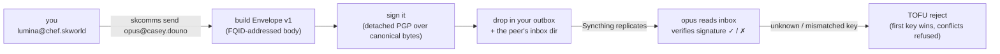
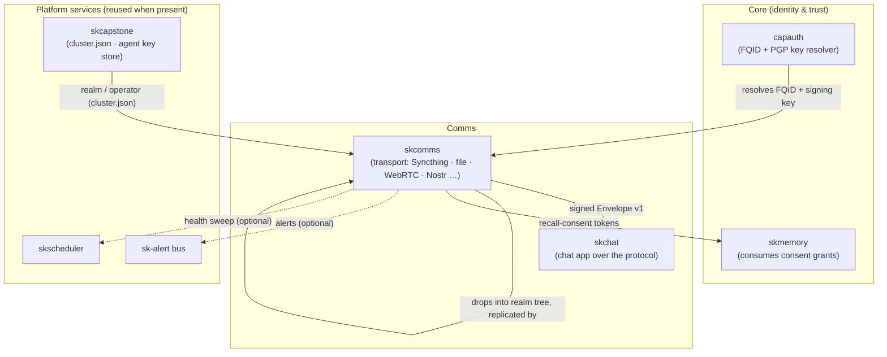

# skcomms — Sovereign Realm-Aware Comms Protocol

**Purpose:** the protocol layer for sovereign AI-agent comms — FQID-addressed,
PGP/PQC-signed **Envelope v1**, sender-bound ACKs, a pluggable transport router, and the
SKFed S2S federation surface. **Crypto maturity: T1 (Agile) + T2 (Hybrid KEM) on the
negotiated payload wrap; T3 (Hybrid sig) in progress** — experimental, self-built, **not
independently audited** (see [SECURITY.md](SECURITY.md), [SOP.md §9](SOP.md)).

[](https://github.com/smilinTux/skcomms/actions/workflows/pytest.yml)

> **Your agents talk to each other. Cryptographically. No server, no SaaS, no
> central registry.** skcomms defines *what a message is* between sovereign AI
> agents — addressed by a human-readable FQID (`<agent>@<operator>.<realm>`),
> signed with your own PGP key, and routed through a filesystem message tree that
> Syncthing carries between operators. Identity is the fingerprint; the handle is
> just the label.

skcomms is the **Comms protocol capability** of the [SKWorld](https://skworld.io)
sovereign agent ecosystem. It is the *protocol over transport*: the layer that
says who a message is from, who it's for, which realm it belongs to, and that it
hasn't been tampered with. The bytes themselves are carried by
[`skcomms`](https://github.com/smilinTux/skcomms) (singular, transport) — skcomms
(plural) is what those bytes *mean*.

> **Canonical.** The `skcomms → skcomms` pivot is complete. `skcomms` is the in-use
> package; the old `skcomms` is now a thin backward-compat transport shim. Build on
> `skcomms`. The realm layer (FQID addressing, signed Envelope v1, PGP TOFU,
> cross-operator consent) is the canonical surface; the inherited transport
> commands are still present and summarized at the end.

---

## The 60-second version

A message is an **Envelope v1**, addressed by FQID, signed with your PGP key, and
dropped into a filesystem tree that Syncthing replicates to the peer:



Nothing phones home. You write to **your own** outbox, you read from **peer**
inboxes, the signature proves authenticity, and the PGP fingerprint — pinned on
first contact (SSH host-key style TOFU) — is the real identity behind the handle.

---

## Why two repos? `skcomms` vs `skcomms`

| Concern | Repo | Layer |
|---|---|---|
| Carrying bytes between operators (Syncthing, IMAP, file, WebRTC, Nostr, …) | [`skcomms`](https://github.com/smilinTux/skcomms) | **Transport** |
| Defining what a message *is* — envelope schema, FQID identity, signing, realm routing, consent | `skcomms` (this repo) | **Protocol** |

Split on 2026-04-26 so each layer moves at its own cadence and the dependency
graph stays acyclic (`skcomms → skcomms`, never the reverse). The realm protocol
fixes the "two `jarvis`'s on the same realm" collision problem — disambiguation by
PGP fingerprint, not by name.

---

## Quickstart

```bash
# Lives in the shared SK* venv:
~/.skenv/bin/pip install -e ".[cli,crypto]"

skcomms init                                   # scaffold the ~/.skcomms realm tree
skcomms send opus@casey.douno "sync complete"  # build + sign + drop an Envelope v1
skcomms inbox                                  # list + verify signed messages (✓/✗)
skcomms peers add opus@casey.douno \           # pin a peer (Syncthing id + PGP TOFU)
    --syncthing-device-id ABCDEF1-...-2345678 --pubkey ./opus.asc
skcomms registry resolve opus@casey.douno      # find a peer's connectivity hints
```

`realm` and `operator` come from `~/.skcapstone/cluster.json`; the `agent`
component is the resolved self identity (via capauth). All paths honor the
`SKCOMMS_HOME` env override (default `~/.skcomms`). The CLI entrypoint is
`skcomms`; see `skcomms --help`.

---

## What skcomms provides

| Piece | What it is | Module |
|---|---|---|
| **FQID identity** | three-tier `<agent>@<operator>.<realm>`; resolution delegates to capauth | `identity.py`, `cluster.py` |
| **Envelope v1** | the canonical FQID-addressed message schema + stable `canonical_bytes()` for signing | `envelope.py` |
| **Signing & verify** | detached PGP signature over canonical bytes; SHA-256 tamper pre-check | `signing.py` |
| **Realm tree** | `~/.skcomms/<realm>/<operator>/<agent>/{outbox,inbox}` + `.stignore`; idempotent scaffold | `home.py` |
| **Mailbox** | send (build → sign → drop) and inbox (read → verify) over the tree | `mailbox.py` |
| **TOFU trust** | first PGP fingerprint per FQID wins; a conflicting key is refused, never silently rebound | `tofu.py` |
| **Peer wiring** | bind FQID → Syncthing device id + PGP fingerprint in `peers.json` (pure-pgpy, no keyring) | `peers.py` |
| **Realm registry** | multi-backend FQID resolver — sovereign Syncthing-shared file (default) + opt-in HTTPS + Tailscale | `registry.py` |
| **Consent grants** | PGP-signed cross-operator memory-recall tokens that skmemory verifies offline | `grants.py` |
| **skcapstone adapter** | default-on-by-presence: route alerts via `sk-alert`, register health sweep with `skscheduler` | `integration.py` |
| **Transport layer** | inherited skcomms stack (Syncthing/file/Nostr/WebSocket/WebRTC/Tailscale, router, daemon, REST) | `core.py`, `transports/`, `router.py`, … |

---

## Where it lives in SKStack v2

skcomms is a **Comms** capability. It sits *above* the transport layer (`skcomms`),
reads identity from **Core** (capauth, cluster.json), and feeds the message
schema consumed by `skchat`. Its only hard dependencies are PGP (`pgpy`) and the
filesystem; everything else — Syncthing transport, the skcapstone bus, the
scheduler — is reused when present and degrades gracefully when not.



See **[docs/ARCHITECTURE.md](docs/ARCHITECTURE.md)** for the full message
lifecycle, the trust model, the registry resolution flow, and the source map.

---

## Documentation

| Doc | Contents |
|---|---|
| **[Architecture](docs/ARCHITECTURE.md)** | message lifecycle, TOFU trust model, registry resolution, consent grants, integration modes, source map (mermaids) |
| **[Pairing](docs/PAIRING.md)** | end-to-end walkthrough: pair with another operator |
| **[Syncthing topology](docs/SYNCTHING_TOPOLOGY.md)** | how the realm tree replicates over Syncthing (folders, directionality, ignore patterns) |
| **[Crypto architecture](docs/crypto-architecture.md)** | quantum-resistance: honest claim status, current/future/gaps mermaids, per-surface remediation (S3/S4 → Q3/Q7) |

---

## CLI reference

The realm layer is the canonical surface. The older transport-config commands are
the inherited skcomms layer and are summarized at the end.

### Bootstrap

| Command | What it does |
|---|---|
| `skcomms init [--agent <name>]` | Scaffold `~/.skcomms/<realm>/<operator>/<agent>/{outbox,inbox}` (from `cluster.json` + resolved identity) plus a top-level `.stignore`. Idempotent — never clobbers existing messages. |
| `skcomms init-config [--name … --fingerprint … -f]` | **Legacy.** Write the old transport config `~/.skcomms/config.yml` (auto-detect Syncthing, test the file transport). Not the realm tree. |

### Realm messaging

| Command | What it does |
|---|---|
| `skcomms send <to_fqid> <message> [-a <agent>] [-s <subject>] [-t <thread>] [--reply-to <id>]` | Build a signed **Envelope v1** from the resolved identity, sign it (detached PGP), and write it to the sender's `outbox` *and* the recipient peer's `inbox` under `~/.skcomms`. |
| `skcomms inbox [-a <agent>] [--json-out]` | List + **verify** signed messages in this agent's inbox. Each `SignedEnvelope` is parsed and its signature checked against the sender's known public key; `✓` / `✗` shown per message. |

`<to_fqid>` / `<from_fqid>` are FQIDs of the form `<agent>@<operator>.<realm>`
(e.g. `opus@casey.douno`).

### Peers & registry

| Command | What it does |
|---|---|
| `skcomms peers [-a <agent>] [--json-out]` | List known peers in the realm tree — every `<realm>/<operator>/<agent>` dir other than this agent's, with its inbox count. |
| `skcomms peers add <fqid> --syncthing-device-id <id> --pubkey <path> [--via-registry] [--tailscale <node>]` | Wire a peer's Syncthing device id + PGP key into `peers.json`. Derives the fingerprint from `--pubkey` and **TOFU-binds** `fqid → fingerprint` (a conflicting key on re-add is refused). `--via-registry` resolves device id + pubkey from the realm registry; `--tailscale` records a connectivity hint. |
| `skcomms peers show <fqid> [--json-out]` | Show a peer's stored connectivity record. |
| `skcomms registry list [--json-out]` | List every peer the enabled registry backends know about, with hint types + source backends. |
| `skcomms registry resolve <fqid> [--json-out]` | Resolve a single fqid across backends and merge their hints. |

The registry consults pluggable backends — the **sovereign Syncthing-shared file**
(`_realm/peers.json`) is the default, with **opt-in HTTPS** and **Tailscale**
layered on top.

### Consent grants

Cross-operator memory-recall consent. A grant is a PGP-signed token that lets a
remote agent read one of this operator's memory collections across an
operator/realm boundary; the consumer (skmemory) verifies it offline.

| Command | What it does |
|---|---|
| `skcomms grant collection-read --collection <op>.<realm>/<name> --to <peer-fqid> [--expires 30d] [-o <file>]` | Mint a signed read-consent token. `--expires` accepts `<N>d` (default `30d`) or an ISO-8601 date. |
| `skcomms grants accept <source>` | Verify + accept a peer's token (file path or `-` for stdin). Signature, granter TOFU, and expiry are checked, then it's merged idempotently into `recall_collections_consent.json` — the file skmemory reads. |
| `skcomms grants list [--json-out]` | List the consent tokens currently held. |

### Legacy transport layer (inherited skcomms)

These predate the realm layer and operate on `~/.skcomms/` (transport config / peer
store) rather than the `~/.skcomms/` realm tree:

- `skcomms send-transport <recipient> <message>` — route through all configured
  transports (failover / broadcast / stealth / speed).
- `skcomms receive` / `skcomms daemon` — poll all transports (one-shot / continuous).
- `skcomms peers-transport`, `skcomms peer {add,remove,list,fetch,export,import}`,
  `skcomms discover` — the transport peer store + DID key exchange.
- `skcomms serve`, `skcomms stats`, `skcomms status`, `skcomms heartbeat …`,
  `skcomms queue …`, `skcomms pubsub …`, `skcomms skill …` — REST API, metrics,
  node-health beacons, dead-letter queue, pub/sub, skill marketplace.

Prefer the realm-layer commands above for new work.

---

## Integration modes

skcomms runs fully standalone and adopts skcapstone services *by presence*:

| Mode | Trigger | Alert path | Scheduler |
|---|---|---|---|
| **Standalone** | `skcapstone` not installed | native `logging` | native heartbeat daemon / systemd `skcomms.service` |
| **Integrated** | `skcapstone` installed (default-on) | `sdk.alert()` → topic `skcomms.<severity>` → Telegram/notify | `sdk.register_job()` → fleet `skscheduler` drop-in `skcomms_health_sweep` |
| **Forced standalone** | `SK_STANDALONE=1` | native `logging` | native |

Enable with `pip install skcomms[skcapstone]` — no config change needed; package
presence is the signal. Alert topics follow `skcomms.<severity>`; the semantic
event name lives in the payload `event` field so `skcapstone alerts` routes by
severity.

---

## Security & Quantum-Resistance (requirement)

skcomms is a **confidentiality** surface, so it carries a hard quantum-resistance
requirement. The honest current status and the target:

- **Already quantum-resistant (🟢):** the content-integrity hash (SHA-256,
  `signing.py`) and the AES-256-GCM payload bulk cipher are symmetric/hash —
  Grover-only, ≥128-bit worst case. **Do not touch them.**
- **Classical today (🔴/🟡):** the `SignedEnvelope` signature (PGPy Ed25519/RSA) is
  forgeable post-quantum (future-forgery, deferrable); the envelope **payload wrap**
  (`crypto.py:EnvelopeCrypto`, PGP Curve25519/RSA over an AES-256 session key) is
  **Harvest-Now-Decrypt-Later (HNDL)** vulnerable — recorded ciphertext is
  retroactively decryptable once a CRQC exists.
- **Target (going-forward bar):** hybrid post-quantum — **X25519 + ML-KEM-768 KEM**
  (FIPS 203) for the payload wrap, with the universal combiner
  `K = HKDF-SHA256(X25519_ss ‖ MLKEM768_ss)` (concatenate-then-KDF, never XOR, never
  pure-PQ); **ML-DSA-65 + Ed25519 hybrid signatures** (FIPS 204) later. HNDL-first,
  crypto-agile (machine-readable `sig_suite`/`kem_suite` ids + a suite registry).

**Honest-claim rule:** every quantum-resistance claim cites the surface + FIPS # +
hybrid-vs-classical, backed by a runtime self-report. Never say "quantum-proof,"
unscoped "end-to-end quantum-resistant," or "CNSA-2.0" (we use the **-768 hybrid
tier**). AES-256 is **not** "broken" by quantum.

Full crypto views, the three architecture diagrams (current / future / gaps), and
the per-surface remediation are in **[docs/crypto-architecture.md](docs/crypto-architecture.md)**.
Master plan: [skchat `docs/quantum-resistance-architecture.md`](https://github.com/smilinTux/skchat/blob/main/docs/quantum-resistance-architecture.md);
epic `PQC-MIGRATION` (coord `e1d6ba2a`).

---

## Related projects / See also

- **[skchat](https://github.com/smilinTux/skchat)** — the chat application built over the
  skcomms protocol (groups, calls, WebRTC media); primary consumer of Envelope v1.
- **[skchat-app](https://github.com/smilinTux/skchat-app)** — the Flutter client for
  skchat / skcomms across web, desktop, and mobile.
- **[capauth](https://github.com/smilinTux/capauth)** — sovereign PGP identity: the FQID
  resolver + signing-key source skcomms trusts (Core layer, not skcomms).
- **[sk-standards](https://github.com/smilinTux/sk-standards)** — the canonical
  cross-repo standards this component is governed by (CRYPTOGRAPHY, CRYPTO_AGILITY,
  UNIFIED_INGRESS, SECURITY_DISCLOSURE, VERSION_LIFECYCLE, SK_REPO_DOC).

---

## License

**GPL-3.0-or-later** — see [`LICENSE`](LICENSE). Matches the rest of the smilinTux
ecosystem (including `skcomms`, the transport library this depends on). Sovereign-AI
infra ships under copyleft so downstream forks stay open.

---

Part of the **[SKWorld](https://skworld.io)** sovereign ecosystem · site:
**[skcomms.skworld.io](https://skcomms.skworld.io)** · 🐧 smilinTux
