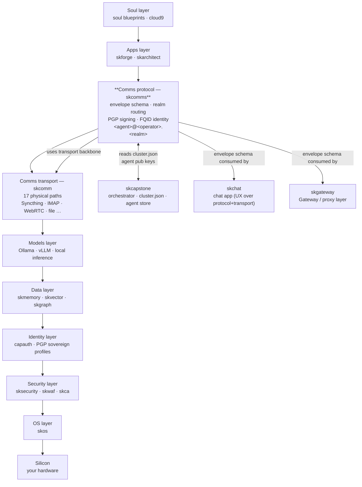

# skcomms

> **Canonical.** The skcomm→skcomms pivot is complete: `skcomms` (plural) is the
> in-use package (FQID `<agent>@<operator>.<realm>` sovereign addressing,
> capauth as identity source of truth). The old `skcomm` is now a thin
> backward-compat shim that re-exports from here. Build on `skcomms`.

**Realm-scoped routing protocol for sovereign AI agents.**

`skcomms` (plural) is the **protocol layer** for cross-cluster
agent communication — *protocol over transport*:

- **Three-tier identity** — `<agent>@<operator>.<realm>` (e.g.
  `lumina@chef.skworld`), with PGP fingerprint as the canonical
  disambiguator.
- **Signed envelopes** — every outgoing message carries a detached
  PGP signature; unsigned envelopes are silently rejected.
- **Realm-namespaced routing** — message tree at `~/.skcomms/`
  with strict directionality (you write to your own outbox, you
  read from peer outboxes, never the reverse).
- **Sovereign-local memory** — `~/.skcapstone/agents/` *never* crosses
  realms. Only `~/.skcomms/` traverses Syncthing.

`skcomms` depends on [`skcomm`](https://github.com/smilinTux/skcomm)
(singular) for the underlying transport plumbing
(Syncthing/IMAP/file/etc).

---

## skcomm vs skcomms — the split

| Concern | Repo | Layer |
|---|---|---|
| Carrying bytes between operators (Syncthing, IMAP, file, WebRTC, …) | [`skcomm`](https://github.com/smilinTux/skcomm) | Transport |
| Defining what a message *is* (envelope schema, identity, signing, routing semantics) | `skcomms` (this repo) | Protocol |

The two layers were kept together briefly during early prototyping;
on 2026-04-26 they were split into separate repos so each can move
at its own cadence and so the dependency graph stays acyclic
(`skcomms` → `skcomm`, never the reverse).

See the design doc at `~/clawd/gtd/next/SKCOMMS_REALM_DESIGN.md`
for the full architecture rationale, including the "two `jarvis`'s
on the same realm" collision problem this fixes.

---

## Status

The realm layer is **built and shipped** (scaffold landed 2026-04-26, coord task
`893d26dc`; the protocol layer T1–T13 shipped 2026-06-10). Tracked, tagged
`skcomms`, on the SKCapstone coordination board:

```bash
skcapstone coord status
# or filter:
ls ~/.skcapstone/coordination/tasks/ | grep skcomms
```

Phase map (all shipped):

| Phase | Tasks | What landed |
|---|---|---|
| 1 — Identity bootstrap | T1, T2, T3 | `cluster.json`, fqid in `identity.json`, PGP TOFU |
| 2 — Comms scaffold | T4, T5, T6 | `~/.skcomms/` tree, envelope sign/verify, CLI |
| 3 — Syncthing wiring | T7, T8 | Topology doc, `skcomms peers add` |
| 4 — Vector namespacing | T9, T10 | recall_collections prefix + consent tokens |
| 5 — Discovery | T11 | Realm peer registry (Syncthing / HTTPS / Tailscale) |
| 6 — Rollout + docs | T12, T13 | Bootstrap chef.skworld (op), full doc rollup |

T12 (bootstrap `chef.skworld` on this box) is a one-time `skcomms init` op.

---

## Install

```bash
# Lives in the shared SK* venv:
~/.skenv/bin/pip install -e ".[cli,crypto]"
```

The CLI entrypoint is `skcomms`. See `skcomms --help`.

---

## CLI reference

The realm layer (FQID addressing, signed Envelope-v1, PGP TOFU, cross-operator
consent) is the canonical surface. The older transport-config commands
(`send-transport`, `peers-transport`, `peer …`, `discover`, `init-config`,
`receive`, `daemon`, `serve`, `heartbeat`, `queue`, `pubsub`, `skill`) are the
inherited skcomm layer and are summarized at the end.

> Paths below honor the `SKCOMMS_HOME` env override and otherwise default to
> `~/.skcomms`. `realm` and `operator` come from `~/.skcapstone/cluster.json`;
> the `agent` component comes from the resolved self identity.

### Bootstrap

| Command | What it does |
|---|---|
| `skcomms init [--agent <name>]` | Scaffold the realm message tree: `~/.skcomms/<realm>/<operator>/<agent>/{outbox,inbox}` (derived from `cluster.json` + the resolved agent identity) plus a top-level `.stignore` so Syncthing ignores volatile/local files. Idempotent — never clobbers existing messages. `--agent` overrides identity resolution. |
| `skcomms init-config [--name …] [--fingerprint …] [-f]` | **Legacy.** Writes the old transport config `~/.skcomm/config.yml` (auto-detects Syncthing, tests the file transport). Not the realm tree — use `init` for that. |

### Realm messaging

| Command | What it does |
|---|---|
| `skcomms send <to_fqid> <message> [-a <agent>] [-s <subject>] [-t <thread>] [--reply-to <id>]` | Build a signed **Envelope v1** from the resolved identity, sign it (detached PGP), and write it to the sender's `outbox` *and* the recipient peer's `inbox` under `~/.skcomms`. Example: `skcomms send opus@casey.douno "sync complete"`. |
| `skcomms inbox [-a <agent>] [--json-out]` | List + **verify** signed messages in this agent's inbox. Each `SignedEnvelope` is parsed and its signature checked against the sender's known public key; verified (`✓`) / failed (`✗`) is shown per message. |

`<to_fqid>` / `<from_fqid>` are FQIDs of the form `<agent>@<operator>.<realm>`
(e.g. `opus@casey.douno`).

### Peers & registry

`peers` manages the realm tree + the Syncthing-device/PGP-key bindings in
`peers.json`. `registry` is the read-only multi-backend resolver.

| Command | What it does |
|---|---|
| `skcomms peers [-a <agent>] [--json-out]` | List known peers in the realm tree — every `<realm>/<operator>/<agent>` dir other than this agent's, with its inbox message count. |
| `skcomms peers add <fqid> --syncthing-device-id <id> --pubkey <path> [--via-registry] [--tailscale <node>]` | Wire a peer's Syncthing device id + PGP key into `peers.json`. Derives the PGP fingerprint from `--pubkey` and **TOFU-binds** `fqid → fingerprint` (a conflicting fingerprint on re-add is refused). `--via-registry` resolves the device id + pubkey from the realm registry instead of passing them explicitly; `--tailscale <node>` records a Tailscale connectivity hint. |
| `skcomms peers show <fqid> [--json-out]` | Show a peer's stored connectivity record (device id, fingerprint, added-at) from `peers.json`. |
| `skcomms registry list [--json-out]` | List every peer the enabled registry backends know about, with their hint types (syncthing / tailscale / https) and source backends. |
| `skcomms registry resolve <fqid> [--json-out]` | Resolve a single fqid across the enabled backends and merge their hints (operator, fingerprint, device id, tailscale, https). |

The registry resolves an fqid by consulting one or more pluggable backends —
the **sovereign Syncthing-shared file** (`_realm/peers.json`) is the default,
with **opt-in HTTPS** and **Tailscale** backends layered on top.

### Consent grants

Cross-operator memory-recall consent. A grant is a PGP-signed token that lets a
remote agent read one of this operator's memory collections across an
operator/realm boundary; the consumer (skmemory) verifies it offline.

| Command | What it does |
|---|---|
| `skcomms grant collection-read --collection <op>.<realm>/<name> --to <peer-fqid> [--expires 30d] [-o <file>]` | Mint a signed read-consent token granting `--to` read on `--collection`. Signed with this agent's PGP key. `--expires` accepts `<N>d` (default `30d`) or an ISO-8601 date. Prints the token JSON (or writes it with `-o`). |
| `skcomms grants accept <source>` | Verify + accept a peer's token. `<source>` is a token file path or `-` for stdin. The signature, granter trust (TOFU), and expiry are verified, then the token is merged idempotently into `${SKCOMMS_HOME:-~/.skcomms}/recall_collections_consent.json` — the file skmemory reads. |
| `skcomms grants list [--json-out]` | List the consent tokens currently held (collection, granted-to, granted-by, expiry). |

A held token grants read when the collection matches, `granted_to` equals the
reader fqid, it has not expired, and the signature verifies against the
granter's TOFU-pinned key.

### Legacy transport layer (inherited skcomm)

These predate the realm layer and operate on the `~/.skcomm/` transport config /
peer store rather than the `~/.skcomms/` realm tree. Documented briefly:

- `skcomms send-transport <recipient> <message>` — route a message through all
  configured transports (failover/broadcast/stealth/speed).
- `skcomms receive` / `skcomms daemon` — poll all transports for incoming
  messages (one-shot / continuous).
- `skcomms peers-transport`, `skcomms peer {add,remove,list,fetch,export,import}`,
  `skcomms discover` — the transport peer store + DID key exchange.
- `skcomms serve`, `skcomms stats`, `skcomms status`, `skcomms heartbeat …`,
  `skcomms queue …`, `skcomms pubsub …`, `skcomms skill …` — REST API,
  metrics, node-health beacons, dead-letter queue, pub/sub, skill marketplace.

Prefer the realm-layer commands above for new work.

See **[Getting started: pair with another operator](docs/PAIRING.md)** for an
end-to-end walkthrough.

---

---

## First Principles & The Full Vertical

> **Get back to first principles.**
> The modern stack is rented. Your messages travel over protocols you didn't design, signed by keys someone else issued, routed by registries you can't audit. You don't own it — you're a tenant.
>
> skcomms is your **Comms protocol layer**. The schema is yours. The signing is yours. The realm topology is yours. Every layer open. Every layer **yours**.

**skcomms is the Comms protocol sub-layer of the SKWorld full vertical** — the layer that defines *what a message is*, how it carries sovereign identity, and how realms route to each other without a central authority.

### The full vertical

| Layer | Product(s) |
|---|---|
| **Soul** | soul blueprints · cloud9 |
| **Apps** | skforge · skarchitect |
| **Comms** | skcomm · **skcomms** · skchat · skvoice |
| **Models** | skmodel (Ollama/vLLM) |
| **Data** | skmemory · skdata · skvector · skgraph |
| **Identity** | capauth · skaid |
| **Security** | sksecurity · skwaf · skca |
| **OS** | skos |
| **Silicon** | *your hardware* |

skcomms answers the protocol question at the Comms layer: *what does a message look like, who signed it, and which realm does it belong to?* skcomm (singular) carries the bytes; skcomms (plural) defines what those bytes mean. The split keeps the dependency graph acyclic and lets each layer evolve at its own cadence.

### Data sovereignty

Your messages carry your identity — cryptographically, in a detached PGP signature you generated on your hardware. The realm tree at `~/.skcomms/` is yours: you write to your own outbox, you read from peer outboxes, and sovereign agent memory at `~/.skcapstone/agents/` never crosses realm boundaries. Nothing phones home. You can walk away and take every envelope with you.

### SKCapstone alignment

**Integrated skcapstone subsystem — pre-alpha.** skcomms resolves cluster identity from `~/.skcapstone/cluster.json` and agent public keys from `~/.skcapstone/agents/<agent>/identity/agent.pub`. The fully-qualified agent identifier (`<agent>@<operator>.<realm>`) is grounded in the skcapstone identity model. Implementation tracks against the skcapstone coordination board (coord tasks T1–T13, tagged `skcomms`). At full phase-6 rollout skcomms will be a registered skcapstone subsystem alongside skcomm, skchat, and skgateway.

### Where skcomms fits in the vertical



---

## Integration modes

skcomms supports three runtime modes with respect to skcapstone:

| Mode | Trigger | Alert path | Scheduler |
|---|---|---|---|
| **Standalone** | `skcapstone` not installed, or `SK_STANDALONE=1` | Native `logging` (structured log at matching level) | Native heartbeat daemon / systemd `skcomms.service` |
| **Integrated** | `skcapstone` installed (default-on by presence) | `sdk.alert()` → PubSub topic `skcomms.<severity>` → Telegram/notify | `sdk.register_job()` → fleet `skscheduler` drop-in `skcomms_health_sweep` |
| **Forced standalone** | `SK_STANDALONE=1` env var | Native `logging` | Native |

### Enabling integration

```bash
pip install skcomms[skcapstone]
```

No config change needed — presence of the `skcapstone` package is the signal.

### `~/.skcapstone/` filesystem contract

When integrated, skcomms writes:
- `~/.skcapstone/config/jobs.d/skcomms_health_sweep.yaml` — fleet scheduler drop-in
- `~/.skcapstone/registry/skcomms.json` — service discovery entry

Alert topics follow the sk* convention: `skcomms.<severity>` (e.g. `skcomms.warn`).
The semantic event name (e.g. `delivery_failed`) lives in the payload `event` field —
not the topic suffix — so `skcapstone alerts` routes by severity.

---

## License

**GPL-3.0-or-later** — see [`LICENSE`](LICENSE).

Matches the rest of the smilinTux ecosystem (`skcomm`, the transport
library this depends on, is also GPL-3.0-or-later). Sovereign-AI infra
ships under copyleft so downstream forks stay open.
