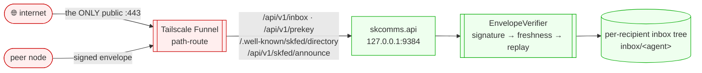

# skcomms — Standard Operating Procedures

Sovereign realm-aware comms protocol: defines *what a message is* between AI agents
(FQID-addressed `<agent>@<operator>.<realm>`, PGP/PQC-signed envelopes) and serves the
SKFed S2S federation surface. Consumed by skchat, skcapstone, and peer nodes.

## 1. Overview

**Owns:** the envelope format, the FQID identity model, the signing/verification layer
(`EnvelopeSigner` / `EnvelopeVerifier`), the SKFed S2S API (inbox, prekey, directory),
and the per-realm discovery directory.

**Does NOT do:** UI/chat experience (that's skchat), identity root-of-trust (that's
capauth), or general transport bytes (the legacy singular `skcomm` shim).

## 2. Architecture

internet → `:443` Funnel → `skcomms.api` (localhost:9384) → envelope verify → recipient
inbox. Every S2S envelope is PGP/PQC-signed and self-authenticates at the envelope layer
(the federation endpoints are public-by-design).

## 3. Build

Python package (`src/skcomms`). `python -m venv ~/.skenv && ~/.skenv/bin/pip install -e .`
PQ legs bind liboqs (ML-KEM-768 / ML-DSA-65) via `oqs`; pure-pyca paths run without it.

## 4. Test

`pytest` — unit + integration (signing, crypto, directory, registry). Green bar gates
release. PQ tests skip cleanly when liboqs is absent.

## 5. Release / Deploy

Library release: bump `version` in `pyproject.toml`, dated `CHANGELOG.md` entry, run the
gate, `git tag vX.Y.Z`, push. Service runs as a `systemd` user unit invoking
`uvicorn skcomms.api:app --host 127.0.0.1 --port 9384` (or `skcomms serve`).

### Front-end / Exposure

Per [sk-standards `UNIFIED_INGRESS_STANDARD.md`](https://github.com/smilinTux/sk-standards/blob/main/standards/UNIFIED_INGRESS_STANDARD.md):

- **Tier:** `0 Direct (Funnel :443 path-route)`. Single node, federation endpoints
  mounted straight onto Tailscale Funnel — no reverse proxy. This is exactly how `.158`
  and `.41` run today.
- **Public `:443` route(s)** (path-preserved Funnel mounts, `skcomms.api`):
  - `POST /api/v1/inbox` — S2S signed-envelope receive (per-recipient routing to
    `inbox/<agent>`).
  - `GET /api/v1/prekey` / `POST /api/v1/prekey` — hybrid-KEM prekey publish/fetch.
  - `GET /.well-known/skfed/directory` — CapAuth-signed per-realm directory.
  - `POST /api/v1/skfed/announce` — gated self-announce into the realm directory.
- **Bind address:** `127.0.0.1:9384` (`skcomms.api`, default `--host 127.0.0.1`).
  **Never an internet-exposed port** — Funnel is the sole ingress. (`cot_service.py`
  defaults to `0.0.0.0` for the TAK stream on the tailnet; that is a separate,
  non-federation surface and is not Funnel-exposed.)

## 6. Configuration / Usage

API port from config (default 9384, `mcp_server.py`). Peers wired in `peers.json`
(FQID → Syncthing device id + PGP fingerprint, TOFU-bound). Secrets are never inlined —
keys come from the agent's CapAuth profile.

## 7. API / Reference

FastAPI app `skcomms.api:app`. Health `GET /health`; status `GET /api/v1/status`;
capabilities `GET /api/v1/capabilities`; federation routes per §5. CLI: `skcomms serve`,
`skcomms peers add`, `skcomms send`.

## 8. Troubleshooting

| Symptom | Check |
|---|---|
| Peer envelope 401/replay | `EnvelopeVerifier` signature → freshness → replay; clock skew, pinned fingerprint |
| Funnel path 404 | each federation path mounted at its *full* target path (`--set-path` preserves path) |
| PQ leg unavailable | liboqs / `oqs` importable; falls back to classical suite |

## 9. Maturity-tier + Version reference

Crypto component. Hybrid KEM `HKDF(X25519 ‖ MLKEM768)` + ML-DSA-65/Ed25519 sigs — see
[CRYPTOGRAPHY_STANDARD.md](https://github.com/smilinTux/sk-standards/blob/main/standards/CRYPTOGRAPHY_STANDARD.md).
VERSION_LIFECYCLE: Active v2. SemVer per `pyproject.toml`.
