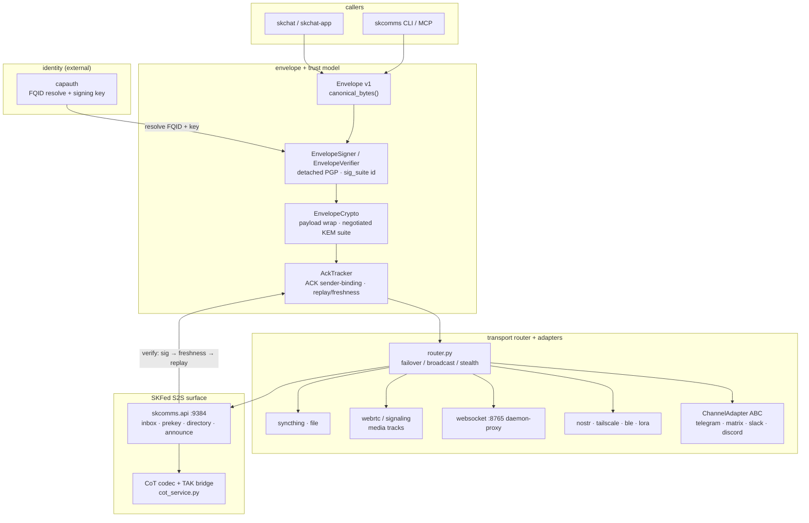

# skcomms — Standard Operating Procedures

Sovereign realm-aware comms protocol: defines *what a message is* between AI agents
(FQID-addressed `<agent>@<operator>.<realm>`, PGP/PQC-signed envelopes), carries it over
pluggable transports, and serves the SKFed S2S federation surface. Consumed by skchat,
skchat-app, skcapstone, and peer nodes. **Crypto component** — governed by the
sk-standards [CRYPTOGRAPHY_STANDARD](https://github.com/smilinTux/sk-standards/blob/main/standards/CRYPTOGRAPHY_STANDARD.md).

## 1. Overview

**Owns:** the Envelope v1 format + canonical signing bytes (`envelope.py`), the FQID
identity model (`identity.py`, `cluster.py`), the signing/verification layer
(`EnvelopeSigner` / `EnvelopeVerifier`, `signing.py`, `crypto.py`), the ACK / replay /
sender-binding layer (`ack.py`), the transport router + adapters (`transports/`,
`adapters/`, `router.py`), the CoT (Cursor-on-Target) codec + TAK bridge (`cot.py`,
`cot_service.py`), the SKFed S2S API (inbox, prekey, directory — `skfed_directory.py`,
`skfed_resolve.py`), and the per-realm discovery registry (`registry.py`).

**Does NOT do:** UI/chat experience (that's [skchat](https://github.com/smilinTux/skchat)
/ [skchat-app](https://github.com/smilinTux/skchat-app)), identity root-of-trust or key
custody (that's [capauth](https://github.com/smilinTux/capauth)), or the standards
themselves (that's [sk-standards](https://github.com/smilinTux/sk-standards)).

## 2. Architecture



**Start here** (entry-point files a reader should open first):
- `src/skcomms/envelope.py` — Envelope v1 schema, `canonical_bytes()`, `sig_suite`/`kem_suite` ids.
- `src/skcomms/signing.py` + `src/skcomms/crypto.py` — signature layer and the negotiated payload-wrap (hybrid-KEM gate).
- `src/skcomms/ack.py` — ACK tracker with sender-binding (rejects ACKs not from the intended recipient).
- `src/skcomms/api.py` — FastAPI SKFed S2S app (inbox / prekey / directory / announce).
- `src/skcomms/transports/` + `src/skcomms/adapters/base.py` — transport router legs and the `ChannelAdapter` ABC.

## 3. Build

Python package (`src/skcomms`). `python -m venv ~/.skenv && ~/.skenv/bin/pip install -e ".[cli,crypto]"`.
PQ legs bind liboqs (ML-KEM-768 / ML-DSA-65) via `oqs`; pure-pyca/pgpy paths run without
it and fall back to the classical suite. We **bind vetted crypto, never hand-roll**
primitives.

## 4. Test

`pytest` — unit + integration (envelope signing, crypto negotiation, ACK sender-binding,
directory, registry, adapters). Green bar gates release. PQ tests skip cleanly when
liboqs / `oqs` is absent. `ruff check .` + `black --check .` for lint.

## 5. Release / Deploy

Library release: bump `version` in `pyproject.toml`, add a dated `CHANGELOG.md` entry,
run the gate (`pytest` + `ruff`), `git tag vX.Y.Z`, push. Service runs as a `systemd`
user unit invoking `uvicorn skcomms.api:app --host 127.0.0.1 --port 9384` (or
`skcomms serve`).

### Front-end / Exposure

Per sk-standards
[UNIFIED_INGRESS_STANDARD.md](https://github.com/smilinTux/sk-standards/blob/main/standards/UNIFIED_INGRESS_STANDARD.md):

- **Ingress tier:** `0 Direct (Tailscale Funnel :443 path-route)`. Single node,
  federation endpoints mounted straight onto Funnel — no reverse proxy. This is how
  `.158` and `.41` run today.
- **Public `:443` route(s)** — the *only* internet-facing surface (path-preserved Funnel
  mounts onto `skcomms.api`), every request self-authenticating at the envelope layer:
  - `POST /api/v1/inbox` — S2S signed-envelope receive (routed to `inbox/<agent>`).
  - `GET|POST /api/v1/prekey` — hybrid-KEM prekey publish/fetch.
  - `GET /.well-known/skfed/directory` — CapAuth-signed per-realm directory.
  - `POST /api/v1/skfed/announce` — gated self-announce into the realm directory.
- **Bind addresses (NEVER an internet-exposed port):**
  - **S2S inbox / API — `127.0.0.1:9384`** (`skcomms.api`, default `--host 127.0.0.1`).
    Reached from the internet *only* via the Funnel `:443` mount above; the socket itself
    is loopback.
  - **Prekey / inbox daemon-proxy — `:8765`** (`node_registry.py` `DEFAULT_DAEMON_PORT`,
    `transports/websocket.py` default `ws://localhost:8765/skcomms/ws`). Serves
    `/api/v1/inbox` + `/api/v1/prekey` to peers **over the tailnet** (e.g.
    `http://100.x.x.x:8765/...`) — **not** Funnel-exposed, **never** bound to a public
    interface.
  - **CoT / TAK stream — `cot_service.py`** defaults to `0.0.0.0` on the **tailnet only**
    (real ATAK/iTAK clients); it is a separate, non-federation surface and is **not**
    Funnel-exposed. Keep it firewalled to the tailscale interface.
- **Rule:** Funnel `:443` is the sole ingress. No skcomms socket is ever published to a
  public interface directly.

#### Browser origins / CORS

The same `skcomms.api` app that Funnel exposes also carries loopback-gated **operator**
surfaces: `POST /mcp` fires desktop notifications, `POST /api/v1/send` sends messages as
the agent, and the consent endpoints (`/api/v1/consent/*`) trust the client IP, which a
browser running on the operator's own machine satisfies. A permissive
`Access-Control-Allow-Origin` therefore lets **any web page the operator visits** drive
those operator actions cross-origin from inside the trust boundary. CORS is not an
authentication layer, it only decides which origins a browser will let script the API, so
it is scoped tight:

- **Allowlist is empty by default.** No cross-origin browser request is approved unless an
  origin is explicitly listed. There is no wildcard.
- Configure via `SKCOMMS_CORS_ORIGINS`: a comma-separated list of exact origins (scheme +
  host + optional port), e.g. `SKCOMMS_CORS_ORIGINS=https://hub.skworld.io,http://localhost:3000`.
  Whitespace is trimmed and blank entries dropped (`api._cors_allow_origins`).
- **Which surfaces need a browser:** none of the public federation routes in this section
  (`/api/v1/inbox`, `/api/v1/prekey`, `/.well-known/skfed/directory`,
  `/api/v1/skfed/announce`) are browser-driven, they are server-to-server and
  self-authenticating at the envelope layer, so they need no CORS entry. The operator
  surfaces (`/mcp`, `/api/v1/send`, `/api/v1/consent/*`) are reached from the same host and
  likewise need none by default. Add an origin ONLY for a specific first-party web client
  you intend to let script the API from a browser, and only for the host that serves it.

## 6. Configuration / Usage

API port from config (default 9384, `config.py` / `mcp_server.py`). Peers wired in
`peers.json` (FQID → Syncthing device id + PGP fingerprint, TOFU-bound). Realm/operator
come from `~/.skcapstone/cluster.json`; the `agent` component resolves via capauth. All
paths honor the `SKCOMMS_HOME` override (default `~/.skcomms`). `SK_STANDALONE=1` forces
standalone mode. Secrets are never inlined — keys come from the agent's CapAuth profile.

### Housekeeping / retention

The file-based rails are append-only at write time: sender outboxes
(`{id}.skc.json`), receiver `archive/` dirs, and mailbox outbox records all grow
without bound unless swept (a 140k-file outbox once pegged Syncthing and froze a
fleet laptop). Retention is configured in the `housekeeping:` block of
`config.yml` (`skcomms.config.HousekeepingConfig`); defaults:

| Key | Default | Meaning |
|---|---|---|
| `enabled` | `true` | run the background housekeeping loop in the daemon |
| `interval_s` | `3600` | seconds between daemon passes (hourly) |
| `outbox_max_age_hours` | `48` | sender-outbox envelopes older than this are deleted (`prune_outbox`) |
| `archive_ttl_hours` | `168` (7 days) | receiver-archive files older than this are deleted (`prune_archive`) |
| `mailbox_ttl_hours` | `168` (7 days) | mailbox outbox records (`<realm>/<operator>/<agent>/outbox/*.json`) older than this are deleted |

The running API daemon starts the loop automatically from `api.lifespan`
(`skcomms.housekeeping.housekeeping_loop`). `skcomms housekeep` runs one full
pass on demand (outbox prune + archive TTL + mailbox retention) and is the verb
to call from a systemd timer or cron as belt-and-braces on hosts where the
daemon is not always up. Per-run overrides: `--outbox-max-age-hours`,
`--archive-ttl-hours`, `--mailbox-ttl-hours`; `--json-out` prints
machine-readable counts.

## 7. API / Reference

FastAPI app `skcomms.api:app`. Health `GET /health`; status `GET /api/v1/status`;
capabilities `GET /api/v1/capabilities`; federation routes per §5. CLI:
`skcomms init`, `skcomms send <fqid> <msg>`, `skcomms inbox`, `skcomms peers add`,
`skcomms registry resolve`, `skcomms grant …`, `skcomms serve`,
`skcomms housekeep` (one full retention pass, timer-friendly; see §6). Full command matrix in
[README.md](README.md) and [docs/ARCHITECTURE.md](docs/ARCHITECTURE.md).

## 8. Troubleshooting

| Symptom | Check |
|---|---|
| Peer envelope 401 / replay | `EnvelopeVerifier` order (signature → freshness → replay); clock skew; pinned fingerprint TOFU mismatch |
| ACK ignored / rejected | `ack.py` sender-binding — an ACK whose `sender != intended recipient` is dropped as forgery; check the pending entry's recipient |
| Funnel path 404 | each federation path mounted at its *full* target path (`--set-path` preserves path) |
| Peer can't reach `:8765` | daemon-proxy binds the tailnet, not loopback-only; verify tailscale up + firewall allows tailscale0 |
| PQ leg unavailable | `liboqs` / `oqs` importable; otherwise negotiation falls back to the classical suite (expected, logged) |
| CoT/TAK client can't connect | `cot_service.py` bound to tailnet iface; confirm ATAK/iTAK points at the tailscale IP, not the Funnel host |
| Outbox / archive growing unbounded, Syncthing pegged | daemon housekeeping loop running? (`housekeeping.enabled`, `api.lifespan` log line "Housekeeping loop started"); run `skcomms housekeep --json-out` for an immediate sweep; see §6 retention table |

## 9. Maturity-tier + Version reference

**Crypto maturity: T1 (Agile), with T2 (Hybrid KEM) implemented on the negotiated
payload-wrap surface; T3 (Hybrid sig) in progress.** Honest, surface-scoped basis
(per the T0–T4 self-assessment in
[CRYPTOGRAPHY_STANDARD.md](https://github.com/smilinTux/sk-standards/blob/main/standards/CRYPTOGRAPHY_STANDARD.md)):

- **T1 — Agile: DONE.** Machine-readable suite-ids on every container
  (`envelope.py`: `sig_suite` / `kem_suite`), a suite registry (`skcomms.crypto_suites`),
  a single negotiation gate (`pqdm.negotiate_suite` / `ChatCrypto.negotiated_suite`), and
  a runtime **self-report** surface (`skcomms pqc-report` CLI → the `sksecurity`
  honesty engine `build_project_report`). Downgrade is *detectable* — the negotiated suite id is bound into the
  result, so a stripped hybrid leg no longer reports hybrid.
- **T2 — Hybrid KEM: implemented on the payload-wrap surface (peer-negotiated, not yet
  universal).** `crypto.py:EnvelopeCrypto` negotiates hybrid **X25519 + ML-KEM-768**
  (FIPS 203) **by default when the peer's bundle supports it**, combining as
  `K = HKDF-SHA256(X25519_ss ‖ MLKEM768_ss)` — concatenate-then-KDF, never XOR, never
  pure-PQ. Harvest-Now-Decrypt-Later is neutralised **only when both peers support
  hybrid**; a classical-only peer still negotiates the classical wrap (honest, logged).
- **T3 — Hybrid sig: IN PROGRESS.** The hybrid signature suite `mldsa65-ed25519-v2`
  (ML-DSA-65 + Ed25519, FIPS 204) is wired (`HYBRID_SIG_SUITE`), but the **default
  `sig_suite` is still classical `ed25519-v1`**. Signatures are therefore
  classically forgeable post-quantum — a *future-forgery* risk (deferrable, not HNDL).
- **T4 — Transport-closed: not claimed.** Tailnet / media / CoT legs are classical and
  documented as such in §5.
- **Symmetric/hash floor:** AES-256-GCM bulk + SHA-256 integrity are quantum-acceptable
  (Grover-only, ≥128-bit). AES-256 is **not** "broken" by quantum.

**CRYPTOGRAPHY_STANDARD compliance:** hybrid KEM `HKDF(X25519 ‖ MLKEM768)` (FIPS 203) on
the negotiated payload wrap; ML-DSA-65 + Ed25519 (FIPS 204) signature suite wired,
classical default; every claim is scoped to surface + FIPS number + hybrid-vs-classical.
Forbidden words ("quantum-proof", "quantum-safe", "unbreakable", "CNSA 2.0", "FIPS 206",
"Falcon") are not used — this is the **-768 hybrid tier**, post-quantum / quantum-resistant.
**CRYPTO_AGILITY:** wire tags (`sig_suite`/`kem_suite`) + `skcomms.crypto_suites` registry
+ single-gate negotiation with downgrade-detection — see
[CRYPTO_AGILITY_STANDARD.md](https://github.com/smilinTux/sk-standards/blob/main/standards/CRYPTO_AGILITY_STANDARD.md).

**Version:** SemVer per `pyproject.toml` (`0.1.6`). VERSION_LIFECYCLE phase: **Active**
(pre-1.0 `0.x`; only the latest published `0.x` line gets security fixes). Experimental,
self-built reference implementation — **not** independently security-audited; see
[SECURITY.md](SECURITY.md).

## 10. Cold-machine standup runbook

Standing the daemon up on a fresh host, end to end. The shipped artifacts live in
`contrib/systemd/` (the `systemd` **user** units) and `scripts/bootstrap.sh` (the
idempotent installer). Re-running any step is safe.

### One-shot bootstrap

```bash
git clone https://github.com/smilinTux/skcomms && cd skcomms
scripts/bootstrap.sh
```

That single command, in order:

1. **venv**: creates `~/.skenv` if missing (override with `SKCOMMS_VENV`), upgrades pip.
2. **install**: `pip install -e ".[api,cli,crypto]"`. If a pinned lockfile
   `constraints.txt` is present at the repo root it installs with `-c constraints.txt`;
   otherwise it falls back to unpinned resolution.
3. **scaffold**: `skcomms init` builds the `<realm>/<operator>/<agent>/{outbox,inbox}`
   tree plus the top-level `.stignore` (idempotent; honors `SKCOMMS_HOME`).
4. **identity gate**: `skcomms identity check --strict`. The bootstrap ABORTS
   (exit 1) if no CapAuth private key is present, because the restore MUST
   happen before the daemon's first start (section 11). Keyless dev standups
   may set `SKCOMMS_ALLOW_NO_IDENTITY=1` to continue.
5. **units**: installs `skcomms-api.service`, `skcomms-housekeep.service`, and
   `skcomms-housekeep.timer` into `~/.config/systemd/user/`, then
   `systemctl --user enable --now` on the API service and the housekeeping timer.
6. **Funnel**: prints (does not run) the Tailscale Funnel `:443` mount commands.

Pass `--no-service` to do the env/install/init steps only and skip the unit install
(useful in containers or CI where there is no user systemd bus).

### Verify

```bash
systemctl --user status skcomms-api.service
curl -fsS http://127.0.0.1:9384/health && echo ' OK'   # /healthz works identically
systemctl --user list-timers skcomms-housekeep.timer
```

The API binds loopback only (`127.0.0.1:9384`, per section 5). To make it
internet-reachable, run the Funnel mounts the bootstrap printed **on the public node**:

```bash
tailscale funnel --bg --set-path /api/v1/inbox   http://127.0.0.1:9384/api/v1/inbox
tailscale funnel --bg --set-path /api/v1/prekey  http://127.0.0.1:9384/api/v1/prekey
tailscale funnel --bg --set-path /.well-known/skfed/directory http://127.0.0.1:9384/.well-known/skfed/directory
tailscale funnel --bg --set-path /api/v1/skfed/announce      http://127.0.0.1:9384/api/v1/skfed/announce
```

Funnel `:443` is the sole ingress; no skcomms socket is ever published to a public
interface directly (section 5).

### Where secrets come from (PATHS only, never values)

Nothing in `bootstrap.sh` or the units contains a secret value.

- **Signing / identity keys** resolve at runtime from the agent's **CapAuth profile**,
  not from any file this runbook writes (section 6).
- **Per-host overrides** live in the optional `EnvironmentFile` at
  `~/.config/skcomms/skcomms.env`, referenced by every unit as `EnvironmentFile=-...`
  (the leading `-` makes it optional, so the units start on defaults if it is absent).
  The bootstrap seeds it `0600` with the bind host/port only. Put **paths** to secret
  material there (e.g. `SKCOMMS_KEYRING_DIR=/run/secrets/skcomms`), never the material
  itself. Prefer a `tmpfs`/`/run/secrets`-style path populated out of band.

### Retiring the `.41` hourly purge stopgap

`.41` currently runs a host-local hourly cron that purges the sender outbox by hand,
a stopgap from before retention shipped (the 140k-file outbox that pegged Syncthing,
section 6). `skcomms-housekeep.timer` supersedes it: it runs the same
`skcomms housekeep` pass hourly (`OnCalendar=hourly`, `Persistent=true` so a
powered-off laptop catches up one sweep on boot). Once the timer is live and has run
at least once, **remove the stopgap on `.41`**:

```bash
systemctl --user list-timers skcomms-housekeep.timer          # confirm it is armed
journalctl --user -u skcomms-housekeep.service -n 20 --no-pager   # confirm a pass ran
crontab -l                                                    # find the hourly purge line
crontab -e                                                    # delete the skcomms purge line
```

Do not remove the cron line until the timer shows at least one successful pass in the
journal, so retention coverage is never dropped.

## 11. Identity + trust-state backup/restore and key-loss re-pin runbook

A wiped machine bricks federation even when every message-path fix is in
place. The failure chain: the CapAuth signing/decryption key lives OUTSIDE
the repo, a cold bootstrap without it comes up with a working socket and
dead crypto, and if the key is REGENERATED instead of restored, every
remote peer's TOFU store (`known_fingerprints.json`) hard-CONFLICTs the new
fingerprint. The node is then rejected fleet-wide until each peer manually
re-pins. This section is the standing defense: what to back up, the restore
ordering, the enforcement, and the key-loss recovery procedure.

### The backup set

`skcomms identity backup` archives exactly these (roles in parentheses):

| File | Role |
|------|------|
| `~/.capauth/identity/private.asc` | operator CapAuth private key (SECRET) |
| `~/.capauth/identity/public.asc` | operator CapAuth public key |
| `~/.capauth/identity/profile.json` | CapAuth profile (fingerprint metadata) |
| `~/.skcapstone/agents/<agent>/capauth/identity/{private.asc,public.asc,profile.json}` | per-agent CapAuth keypair + profile (private is SECRET) |
| `~/.skcapstone/agents/<agent>/identity/agent.pub` | agent public key (canonical fingerprint source) |
| `~/.skcapstone/cluster.json` | realm/operator identity tier |
| `$SKCOMMS_HOME/known_fingerprints.json` | TOFU trust store (every peer pin) |
| `$SKCOMMS_HOME/peers.json` | peer connectivity bindings |
| `$SKCOMMS_HOME/outbox/pending/*.json` | undelivered outbox entries |

### Backup (do this NOW, and after any key or peer change)

```bash
skcomms identity backup -o /secure/media/skcomms-identity.tar.gz
skcomms identity check            # verify what the set looks like on this host
```

The archive is written `0600` and contains PRIVATE KEY material: store it
encrypted and OFF the machine (offline media, or a vault reachable without
this node, per the "if you need one, get two" mantra). The backup verb
REFUSES to produce an archive with no private key in it (an archive that
cannot restore crypto is a trap); `--allow-partial` overrides for
trust-state-only snapshots.

### Restore ordering (enforced, not just documented)

On a rebuilt machine the order is: **restore identity and trust state
FIRST, start the daemon SECOND.** Never the reverse, and never regenerate.

```bash
git clone https://github.com/smilinTux/skcomms && cd skcomms
scripts/bootstrap.sh --no-service          # venv + install + init, NO units yet
~/.skenv/bin/skcomms identity restore /secure/media/skcomms-identity.tar.gz
~/.skenv/bin/skcomms identity check --strict   # must exit 0 before continuing
scripts/bootstrap.sh                        # now enable the units
```

Enforcement (all three fail loudly, none quietly INFO-log):

- `scripts/bootstrap.sh` runs `skcomms identity check --strict` and ABORTS
  before enabling any unit when no private key is present.
- `skcomms-api.service` has an `ExecStartPre` identity gate, so even a
  hand-enabled unit refuses to start keyless
  (`SKCOMMS_ALLOW_NO_IDENTITY=1` in the EnvironmentFile overrides for dev).
- `skcomms serve` / `skcomms daemon` warn loudly by default and exit 1 when
  `SKCOMMS_REQUIRE_IDENTITY=1` is set; `/health` and `/healthz` report
  `"status": "degraded"` with an `identity` block whenever the key is
  absent, so a green probe can never hide dead crypto.

Restore semantics are fail-closed: every payload is checksum-verified
against the archive manifest before anything is written, and an existing
file with DIFFERENT content is a conflict that is left untouched (and exits
nonzero) unless `--force`. Use `--dry-run` to preview.

### Key-loss runbook (the key is GONE, no backup restores it)

This is the expensive path; it exists so a fleet outage has a procedure
instead of a panic. Losing the private key means a new keypair, and every
peer that ever pinned the old fingerprint will (correctly) reject the new
one as a TOFU CONFLICT until re-pinned.

1. **Declare it.** Treat the old key as compromised from this moment. If any
   copy might have leaked (stolen laptop vs dead disk), notify the fleet
   out of band FIRST so peers know to distrust the old fingerprint too.
2. **Rotate.** Generate the new CapAuth keypair with the standard capauth
   provisioning for the agent (this recreates
   `~/.capauth/identity/{private.asc,public.asc,profile.json}` or the
   per-agent layout). Record the NEW fingerprint:
   `skcomms identity check` then read it from the CapAuth profile.
3. **Restore trust state.** The TOFU store, `peers.json`, and `cluster.json`
   from the latest backup are still valid (they describe OTHER nodes):
   `skcomms identity restore <archive>` restores them. Expect the CapAuth
   key files to report as conflicts (the archive holds the OLD key, the
   disk holds the NEW one); that is correct, do NOT `--force` over the new
   key. This node still trusts its peers; they do not yet trust it.
4. **Publish the new fingerprint out of band.** Voice, video, or an already
   trusted channel. NEVER over the rejected rail itself: a conflict window
   is exactly when an attacker would race you with their own "new key".
5. **Re-pin on EVERY peer.** On each remote node, the operator verifies the
   fingerprint out of band and runs:

   ```bash
   skcomms identity repin <fqid> <NEW_FINGERPRINT> --reason "key loss 2026-07-10" --yes
   ```

   `repin` is the ONLY sanctioned way to replace a pin. The receive path
   never overwrites on conflict; the previous fingerprint and re-pin
   timestamp stay in the store for audit. Fleet sweep: walk the peer list
   from `skcomms peers`, and confirm on each node that
   `skcomms identity check` shows the updated pin before moving on.
6. **Verify end to end.** From the rotated node, send a signed message to
   each re-pinned peer and confirm delivery (no TOFU CONFLICT in the peer's
   log). From one peer, send back and confirm decryption works.
7. **New backup.** The old archives restore the OLD key. Immediately:
   `skcomms identity backup -o <new archive>`, distribute per the backup
   section, and only then delete archives of the compromised key.
