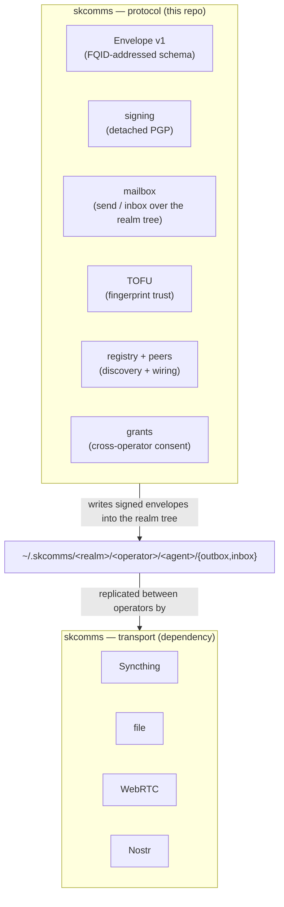
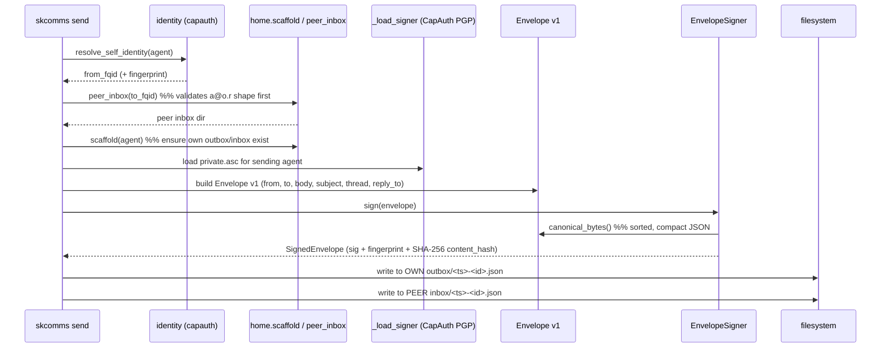
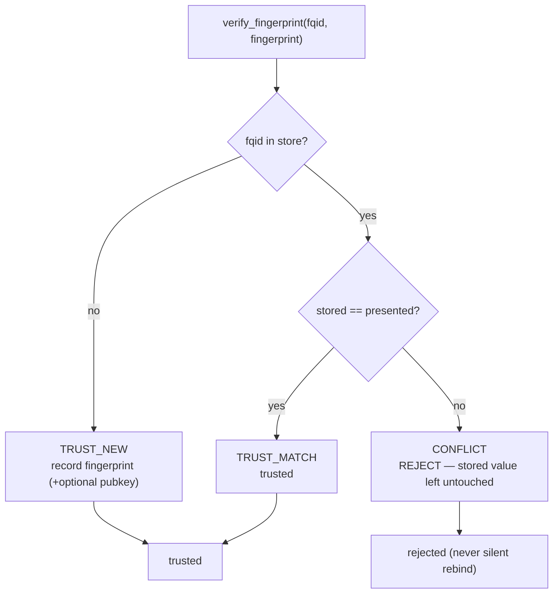
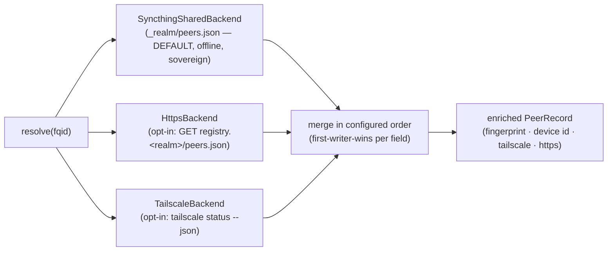
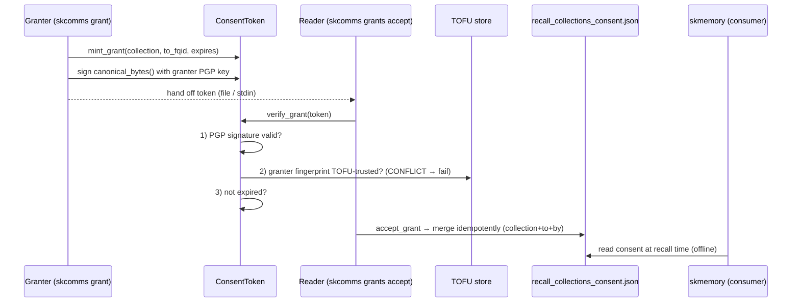
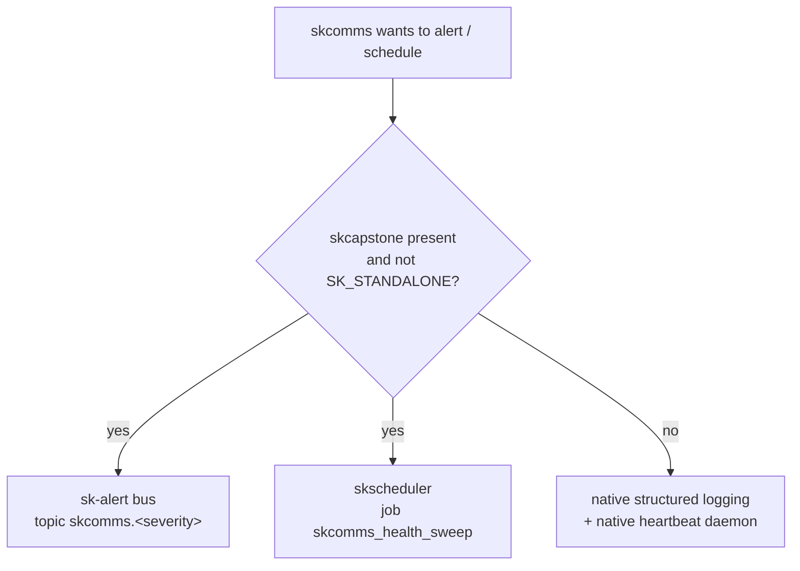
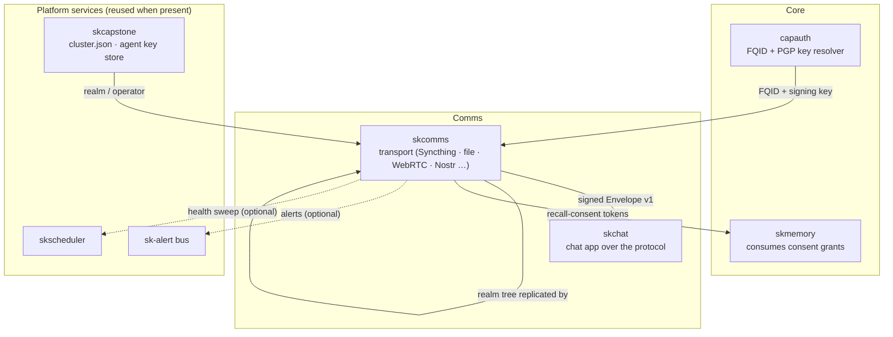

# skcomms Architecture

skcomms is a **protocol over transport**. It does not move bytes — it defines what
a message *is* (an Envelope v1), how it carries sovereign identity (an FQID +
detached PGP signature), how realms route to each other without a central
authority (a filesystem tree Syncthing replicates), and how trust is established
(TOFU on the PGP fingerprint). The whole protocol layer is filesystem + PGP, with
**no live network calls in the hot path** — which is exactly why it is fully
sovereign and fully testable against a temp `SKCOMMS_HOME`.

This document covers: the layering, the message lifecycle, the trust model, the
registry resolution flow, consent grants, integration modes, and a source map.

---

## The two layers



The protocol writes signed envelope files into a directory tree; a transport
(by default Syncthing) replicates that tree to the peer. The protocol never
"calls" the transport — it only depends on the tree being mirrored. This
indirection is what keeps the dependency graph acyclic (`skcomms → skcomms`) and
lets either layer evolve independently.

---

## Identity: three tiers, fingerprint-canonical

An FQID has three tiers, resolved from two sources:

| Tier | Example | Source |
|---|---|---|
| `realm` | `skworld`, `douno` | `~/.skcapstone/cluster.json` (`cluster.py`) |
| `operator` | `chef`, `casey` | `~/.skcapstone/cluster.json` |
| `agent` | `lumina`, `opus` | capauth resolver (`identity.py`) |

Display form: `<agent>@<operator>.<realm>` (e.g. `lumina@chef.skworld`).

The handle is *human-readable*, but **the canonical identity is the PGP
fingerprint**. `identity.resolve_self_identity()` delegates to
`capauth.agent_identity.resolve_agent_identity` (with a minimal fallback when
capauth is absent), returning `{agent, capauth_uri, fqid, fingerprint}`.
`cluster.py` supplies the realm/operator with sane defaults (`skworld` / `chef`)
when no `cluster.json` exists. This is why two agents named `jarvis` on the same
realm don't collide: the fingerprint disambiguates.

---

## The message lifecycle

### Send

`skcomms send <to_fqid> <message>` → `mailbox.send_message`:



The signed envelope is written **twice**: once to the sender's own `outbox` (a
local sent-record) and once to the recipient peer's `inbox` directory under the
realm tree — which is the path Syncthing replicates to the peer. The filename is
`<created_at-with-punctuation-stripped>-<uuid>.json`, so inbox listings sort
chronologically.

### Receive

`skcomms inbox` → `mailbox.read_inbox`:

```mermaid
sequenceDiagram
    participant CLI as skcomms inbox
    participant FS as inbox/*.json
    participant V as EnvelopeVerifier
    participant KEY as _load_verifier_key (sender pubkey)

    loop each *.json (chronological)
        CLI->>FS: read + parse SignedEnvelope
        CLI->>KEY: resolve sender's public.asc by from_fqid
        CLI->>V: add_key(from_fqid, pubkey); verify(signed)
        V->>V: 1) signature present?
        V->>V: 2) signer key known?
        V->>V: 3) content_hash == SHA-256(canonical)?  (tamper pre-check)
        V->>V: 4) PGP signature cryptographically valid?
        V-->>CLI: VerificationResult(valid, reason, fingerprint)
    end
    CLI-->>CLI: render ✓ / ✗ per message
```

Verification is a four-gate check (`signing.EnvelopeVerifier.verify`): signature
present → signer key known → content hash matches → PGP signature valid. A
missing sender key reports an *unknown signer* (not a hard error) so the inbox
still lists the message, marked `✗`.

### Envelope v1 schema

`Envelope` (`envelope.py`) carries `version`, a per-message UUID `id`, `from_fqid`,
`to_fqid`, `created_at` (UTC ISO-8601), `content_type` (default `text/plain`),
`body`, and optional `subject` / `thread_id` / `reply_to` / `headers`.
`canonical_bytes()` produces a **deterministic** serialization (sorted keys,
compact separators, no signature) so signing is order-independent.
`SignedEnvelope` wraps it with `signature` (armored detached PGP),
`signer_fingerprint`, `signed_at`, and `content_hash` (SHA-256 of the canonical
bytes — a cheap tamper pre-check before the expensive PGP verify).

> A legacy transport-level `MessageEnvelope` (`models.py`) and
> `LegacySignedEnvelope` are retained for backward compatibility with the
> inherited skcomms stack; Envelope v1 is the canonical layer above it.

---

## The trust model: TOFU on fingerprints

skcomms trusts keys **Trust-On-First-Use**, SSH host-key style (`tofu.py`):



The first fingerprint seen for an FQID is recorded in
`${SKCOMMS_HOME}/known_fingerprints.json` and trusted. A later contact presenting
a *different* fingerprint for that FQID is a **CONFLICT** and is refused — the
stored value is never silently overwritten. This is the security primitive
underneath both `peers add` and `grants accept`: an attacker who learns a handle
still can't impersonate it without the originally-pinned key.

`peers.add_peer` (`peers.py`) wires this up: it reads the peer's armored pubkey,
derives the fingerprint with **pure pgpy** (no `~/.gnupg` writes, no `gpg`
subprocess), TOFU-binds `fqid → fingerprint`, and persists
`{syncthing_device_id, fingerprint, added_at}` into `peers.json`. A conflicting
key on re-add raises rather than rebinds.

---

## Discovery: the realm registry

T8 `peers.json` answers *"what device + key did I explicitly pin for this fqid?"*.
The registry (`registry.py`) answers the prior question — *"given just an FQID,
how do I find the connectivity details to pin?"* — by consulting pluggable
backends and **merging** their hints into one `PeerRecord`:



- **SyncthingSharedBackend** (default): reads a steward-published
  `${SKCOMMS_HOME}/_realm/peers.json` from a Syncthing *Receive-Only* folder.
  Fully offline, no daemon, no network — the sovereign path.
- **HttpsBackend** (opt-in): GETs `https://registry.<realm>/peers.json`. The HTTP
  fetcher is *injected* so it's testable and never accidental.
- **TailscaleBackend** (opt-in): maps a tailnet node to an FQID by hostname
  convention `skcomms-<agent>-<operator>` (realm is realm-local, not encoded),
  via an *injected* `tailscale status --json` runner.

Backends are consulted in configured order; `PeerRecord.merge` is
**first-writer-wins per field**, so the first backend to supply a value is
authoritative for it. A misbehaving backend returns `None`/`[]` and is skipped —
it never breaks resolution. Sovereign default: only the offline
`syncthing-shared` backend is enabled (`PeerRegistry.from_config`).

---

## Cross-operator consent grants

skcomms is the **producer** of recall-consent grants; `skmemory` is the
**consumer**. A grant is a PGP-signed token that lets a remote agent read one of
this operator's memory collections across an operator/realm boundary, verifiable
*offline* (`grants.py`):



A held token grants read when **all** hold: the collection matches, `granted_to`
equals the reader FQID, it has not expired, and the signature verifies against the
granter's TOFU-pinned key. `--expires` accepts `<N>d` (default `30d`) or an
ISO-8601 date. `accept_grant` writes the exact dict shape skmemory reads into
`${SKCOMMS_HOME}/recall_collections_consent.json`, replacing (not duplicating) a
prior grant with the same `(collection, granted_to, granted_by)`.

> Cross-repo note: skmemory's `_verify_consent_signature()` is the planned call
> site for `verify_grant` — wiring it is an intentional follow-up outside this repo.

---

## The realm tree on disk

`home.py` builds and resolves the tree under `SKCOMMS_HOME` (default `~/.skcomms`):

```
~/.skcomms/
  .stignore                                # Syncthing ignores volatile/local files
  known_fingerprints.json                  # TOFU store (tofu.py)
  peers.json                               # pinned device id + fingerprint (peers.py)
  recall_collections_consent.json          # held consent grants (grants.py)
  _realm/peers.json                        # steward-published registry (read-only folder)
  peers/<fqid>.asc                          # cached peer public keys
  <realm>/<operator>/<agent>/
    outbox/   <ts>-<id>.json               # messages this agent has sent
    inbox/    <ts>-<id>.json               # messages addressed to this agent
```

**Strict directionality**: an agent writes to its *own* `outbox` and to a *peer's*
`inbox`, and reads from its *own* `inbox`. The `.stignore` keeps volatile files
(PID/lock/temp/partial/logs) from ever propagating to peers. The scaffold is
idempotent — re-running `skcomms init` never clobbers existing messages.

---

## Integration: default-on by presence

skcomms runs fully standalone and adopts skcapstone services *only when present*
(`integration.py`, the ADR "optional integration backbone" pattern):



`is_present()` is true only when the `skcapstone` package imported, the SDK
reports available, and `SK_STANDALONE` is unset — any failure degrades to the
native path. `alert()` publishes to `skcomms.<severity>` (the semantic event name
rides in the payload `event` field, so routing stays severity-based);
`ensure_schedule()` writes a `jobs.d/skcomms_health_sweep.yaml` drop-in running
`skcomms status`; `register_self()` advertises the service to discovery. None of
this is a hard dependency — `skcapstone` lives in the optional extra.

---

## Source map

| Module | Role |
|---|---|
| `identity.py` | resolve `<agent>@<operator>.<realm>` + fingerprint via capauth (thin consumer) |
| `cluster.py` | read `cluster.json` → realm / operator (defaults `skworld` / `chef`) |
| `envelope.py` | **Envelope v1** schema + `canonical_bytes()`; `SignedEnvelope` wrapper |
| `signing.py` | `EnvelopeSigner` (detached PGP) + `EnvelopeVerifier` (4-gate verify) + legacy compat |
| `home.py` | scaffold + resolve the `~/.skcomms` realm tree; `peer_inbox()` path mapping |
| `mailbox.py` | `send_message` (build → sign → drop) + `read_inbox` (read → verify) + `list_peers` |
| `tofu.py` | fingerprint Trust-On-First-Use store (TRUST_NEW / TRUST_MATCH / CONFLICT) |
| `peers.py` | bind FQID → Syncthing device id + PGP fingerprint (pure-pgpy, no keyring) |
| `registry.py` | multi-backend FQID resolver (syncthing-shared default + opt-in https/tailscale), merge |
| `grants.py` | mint / verify / accept PGP-signed cross-operator recall-consent tokens |
| `integration.py` | optional skcapstone adapter — sk-alert + skscheduler, default-on by presence |
| `cli.py` | the `skcomms` CLI — realm commands + inherited transport commands |
| `mcp_server.py` | MCP server entrypoint (`skcomms-mcp`) |
| `core.py`, `router.py`, `transport.py`, `transports/` | **inherited skcomms transport stack** (Syncthing/file/Nostr/WebSocket/WebRTC/Tailscale, routing modes) |
| `models.py` | legacy transport `MessageEnvelope` + routing/urgency enums |
| `heartbeat.py`, `discovery.py`, `key_exchange.py`, `peers`-transport, `pubsub*`, `queue.py`, `marketplace.py`, `api.py`, `metrics.py`, `ratelimit.py`, `ack.py`, `compression.py`, `signaling.py`, `*_router.py` | inherited transport-layer services (node beacons, DID exchange, pub/sub, dead-letter queue, REST API, …) |

---

## Where it lives in the ecosystem



skcomms is the **Comms protocol** sub-layer: it defines what a message is, how it
carries sovereign identity, and how realms route to each other without a central
authority. `capauth` (Core) gives it identity; `skcomms` (Comms transport) carries
the bytes; `skchat` consumes the schema; `skmemory` (Core) consumes its consent
grants; the skcapstone platform primitives (`sk-alert`, `skscheduler`) are reused
when present and gracefully absent otherwise.

---

Part of the **[SKWorld](https://skworld.io)** sovereign ecosystem · 🐧 smilinTux

## Federation (SKFed Comms) — strategic build
See **[federation-data-comms-architecture.md](federation-data-comms-architecture.md)** for the
federated-node data-comms architecture: rail-agnostic canonical signed envelope + transport router +
ActivityPub-style S2S + Nostr discovery/store-forward, owner-centric (no full replication), hub-spoke
memory, skos knowledge plane, Flutter OS shell. Coord epic `c26e6fe9` (`skfed-comms`), P0–P9 + the
detailed P1/P2 build spec (§9b) with sequence + topology diagrams. **The current file/legacy message
path is in maintenance mode while this strategic path is deployed.**
