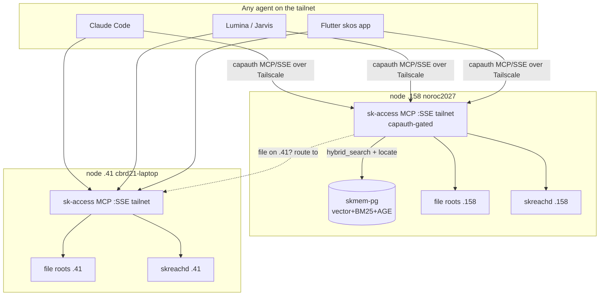
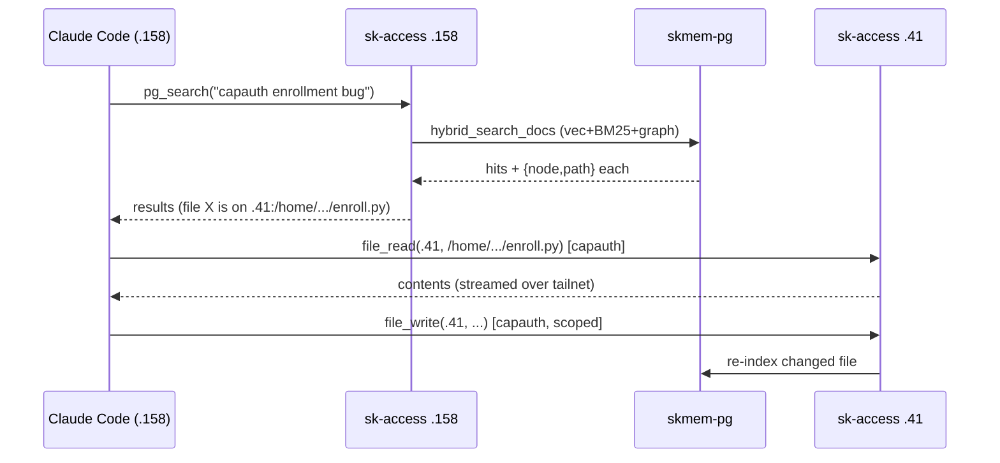
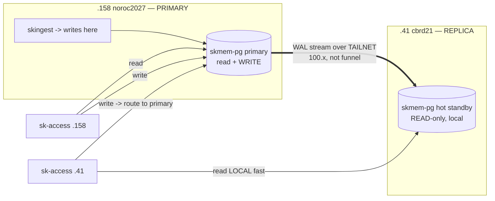

# P7 — The Access Plane: skos everywhere

**Status:** DESIGN (2026-06-22). Epic `c26e6fe9` (SKFed) → P7. Aligns with skreach F1/F2/F3.

## The vision (the chubby part)

> **Any agent, anywhere on the tailnet — Claude Code, Lumina, Jarvis, the Flutter skos app —
> can semantically search the *entire* sovereign corpus and read/write *any* file on *any*
> node, with no file syncing, all capauth-gated.**

Today our knowledge lives in **skmem-pg** on .158 (vector + BM25 + AGE graph, ~27k docs + 15k
memories) and our files live scattered across .158, .41, .100. To use a file an agent has to
*be on that box*. P7 collapses that: a **distributed, AI-native knowledge + filesystem fabric**
where the PG index is the **authoritative `{node, path}` directory**, and a thin **access MCP**
on each node lets any agent do:

1. **Ask** — "find me everything about the capauth enrollment bug" → hybrid search across the
   whole corpus, results tagged with **which node + path** each file lives on.
2. **Fetch** — read that file *from the node it lives on*, streamed over Tailscale. No sync.
3. **Work** — write/patch it in place (capauth-gated, scoped to exposed roots), run a command
   (skreachd), and the change is indexed back into PG.

It turns the whole fleet into **one sovereign brain + one sovereign disk**, addressable by any
LLM, secured by capauth, riding the tailnet we already own. "Claude Code on .158 looks something
up in PG, gets a file that's on .41, reads it, edits it, runs the test on .41 — without anything
being copied." That's P7.

## Planes

| Plane | What | Backed by |
|---|---|---|
| **Knowledge** | hybrid search (vector+BM25+graph), returns `{node, path, score, snippet}` | skmem-pg (.158) |
| **Location** | the authoritative file directory: which node + path holds each indexed file | PG `file_locations` (P8) |
| **File** | read / write / patch / list / stat, scoped to exposed roots, **on the owning node** | per-node access MCP |
| **Exec** | run + stream a command, status, file ops | skreachd (F2) |
| **Control** | capauth auth + RBAC + tailnet binding + skos registration/discovery | capauth + skos |

## Architecture

### Query → locate → fetch (no sync)

## The access MCP — tool catalog (`sk-access`, one per node, SSE over Tailscale)

**Knowledge** — `pg_search(query, k, layer?, agent?)` (hybrid vec+BM25), `pg_locate(query|doc_id)`
(→ `{node,path}`), `graph_query(cypher)` (AGE), `corpus_stats()`.
**File** — `file_read(path)`, `file_write(path, content)`, `file_patch(path, diff)`,
`file_list(dir)`, `file_stat(path)`, `list_roots()` — all scoped to the **exposed-root allowlist**.
**Exec** — `run(cmd, cwd)` + stream stdout, `status()` (via skreachd, F2).
**Node** — `node_info()`, `health()`.

## Security model (capauth, non-negotiable)
- **capauth-gated:** every call carries a capauth-signed token; the MCP verifies signature +
  identity + scope before acting. Reuses the federation `accept_signed` / TOFU machinery.
- **Tailnet-only:** bound to the tailscale0 interface, **never 0.0.0.0/public**. (F1 RBAC spec.)
- **Exposed-root allowlist:** files are only reachable under an explicit allowlist
  (e.g. `~/clawd`, `~/.skcapstone/agents/<self>`); secrets dirs (`~/.ssh`, capauth keys,
  `cot-pki`) are **hard-denied** even if under an allowed root.
- **Scopes / RBAC:** read vs write vs exec, per-identity (member/agent/admin). Default read-only;
  write + exec require elevated scope. Every mutation **audit-logged**.

## Build decomposition (farm to swarm)
- **A1 — PG location index:** `file_locations(node, path, doc_id, mtime, sha)` table + populate
  from skingest; `pg_locate()` resolver. *(P8 overlap — do here.)*
- **A2 — sk-access MCP server skeleton:** SSE/HTTP over tailnet, capauth gate, skos registration,
  config (exposed roots, scopes). Built on `mcp_server.py`.
- **A3 — knowledge tools:** `pg_search`/`pg_locate`/`graph_query`/`corpus_stats` (mxbai embed +
  hybrid_search_docs).
- **A4 — file tools:** read/write/patch/list/stat + root allowlist + hard-deny secrets + audit.
- **A5 — federation routing:** a call for a file on another node transparently routes to that
  node's access MCP (reuse peer directory + tailnet).
- **A6 — capauth/RBAC security** (F1): token verify, scopes, audit log, tailnet binding tests.
- **A7 — skreachd exec** (F2): per-node run+stream+status, wired as the exec tools.
- **A8 — client wiring + E2E:** Claude Code `.mcp.json` over tailnet on both boxes; Lumina/Jarvis
  MCP config; prove "search on .158 → read+edit a file on .41" end to end. (Flutter Files = P9.)

## PG architecture — how the knowledge layer scales (the DB question)

**TL;DR: primary on .158, streaming hot-standby read-replica on .41, over the *tailnet* (NEVER the
Funnel). Reads local, writes to primary, HA-ready.**

### Why NOT the Funnel
Funnel = **public internet** ingress. Exposing the Postgres wire protocol publicly is a hard no —
auth-surface, scanning, data exfil risk. **Replication is private node-to-node** and rides the
**tailnet** (already encrypted, ACL'd, our own). Funnel stays for *guest web* ingress only.

### The model — physical streaming replication (primary + hot standby)

- **.158 = primary** (the single writer; skingest already writes here).
- **.41 = hot standby** read-replica — the `skmem-pg:pg17-bm25-age` mirror image is *already on .41*
  (port 5433, empty); seed it with `pg_basebackup` from .158, then stream WAL over the tailnet.
- **Access MCP reads the LOCAL copy** (sub-ms on each box), **writes go to the primary** (.158).
- **Redundancy mantra satisfied** ("if you need one, get two"): .41 can be **promoted** if .158 dies →
  knowledge survives a primary loss. More nodes later = more cascading read replicas.

### Why physical streaming (vs the alternatives)
| Option | Verdict |
|---|---|
| **Physical streaming (primary+standby)** ✅ | Read-mostly corpus, single writer (ingest), byte-exact, simplest robust HA. **Pick this.** |
| Hub-only (no replica) | Simple but .158 = SPOF for *all* search; no locality. Fine for v0, but violates redundancy mantra. |
| Logical replication (pub/sub tables) | Flexible (replica can hold local extras) but no DDL repl, more moving parts. Revisit if nodes need divergent schemas. |
| Multi-master (BDR/pgEdge) | Overkill + conflict risk. Only if we ever need multi-writer ingest. Not now. |

**Note on extensions:** both nodes run the **same custom image** (`skmem-pg:pg17-bm25-age` =
pgvector + pg_search/BM25 + AGE), so physical replication is clean (identical binaries/extensions).

### Files vs knowledge — two different consistency stories
- **Knowledge (PG):** replicated (above) — small, structured, read-mostly → cheap to keep in sync.
- **Files:** **never replicated** — large, owner-specific. The PG `file_locations` table (replicated
  as part of the DB) is the **directory**; the bytes stay on their node and are fetched on demand via
  that node's access MCP. This is the whole point: *sync the index, not the data.*

## Open questions
- Write-back re-index: synchronous vs queued into skingest?
- File transfer for big/binary files: inline base64 vs a signed one-shot HTTP range fetch?
- Scope granularity: per-root ACLs vs per-identity global scopes for v1 (start global, refine).

## DEPLOYED (core, 2026-06-22)
`skcomms-access.service` LIVE on .158 — `100.108.59.57:9386`, tailnet-only, capauth-gated, 12 tools (10 + node_info/health). A1-A4 done + integrated (`wiring.register_builtin_tools`), 836 tests. Read-only by default (`scope_grants={}`); exposed root `~/clawd`; secrets hard-denied. **Remaining:** A5 federation routing (query any node -> fetch from owning node), A6 RBAC/scope-grants + per-call identity on /sse (F1), A7 skreachd exec (F2), A8 client wiring (Claude Code .mcp.json / agents / Flutter Files P9), deploy sk-access on .41, + live PG primary/replica (supervised).

## A8 — clients wired (2026-06-22)
- **E2E proven:** capauth `pg_search` on .158 + cross-node `file_read` on .41 over the tailnet (both gated).
- **Claude Code:** `~/clawd/.mcp.json` -> `sk-access` SSE at `http://127.0.0.1:9386/sse` (loopback -> A6 dev fallback grants node-local READ; A5 routing reaches remote files). Loads next Claude Code session.
- **Agents (Lumina/Jarvis):** point their MCP client at the local node's sk-access `/sse` (loopback) or `/tool` with a capauth token for write/exec scopes.
- **Both nodes live:** sk-access on .158 (`100.108.59.57:9386`) + .41 (`100.86.156.5:9386`), persistent.
- **Remaining:** grant write/exec to specific identities via `python -m skcomms.access.grants` when needed; live PG primary/replica (supervised); per-session capauth on /sse for non-loopback MCP clients (A6 flag).

## PG replication — LIVE (2026-06-22)
Physical streaming replication is up: **.158 primary → .41 hot-standby**, real-time (lag 0), over the
tailnet (slot `standby_41`). Proven: write on primary appeared on standby <3s. Both containers
`restart=unless-stopped` (reboot-durable).

**Setup recap (non-disruptive — no primary restart):** primary was already `wal_level=replica`/
`max_wal_senders=10`/`hot_standby=on`; added role `replicator` (pwd `skfedrepl2026`), slot `standby_41`,
pg_hba `host replication replicator all scram-sha-256` + reload. Standby seeded with
`pg_basebackup -d "host=100.108.59.57 ... password=..." -Fp -Xs -R -S standby_41` into the
`skmem_pgdata` volume, then `docker start skmem-pg`.

**Ops:** standby is READ-ONLY (`pg_is_in_recovery()=true`); writes go to .158. Health:
`pg_stat_replication` (primary) / `pg_stat_wal_receiver` (standby). **Promote** .41 if .158 dies:
`docker exec skmem-pg pg_ctl promote` (or `SELECT pg_promote()`). **Re-seed:** stop standby, wipe
`skmem_pgdata`, re-run the basebackup. Access plane reads can point at the local replica (sub-ms) +
write to the primary.
