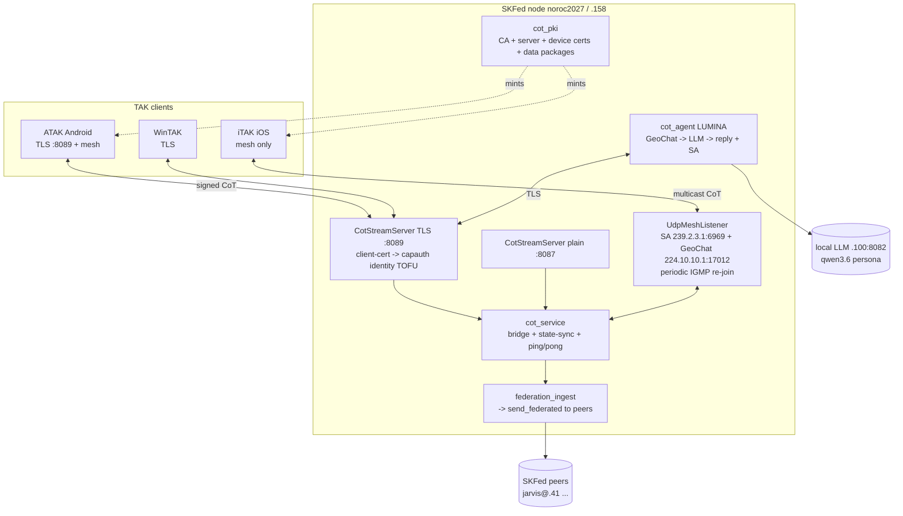
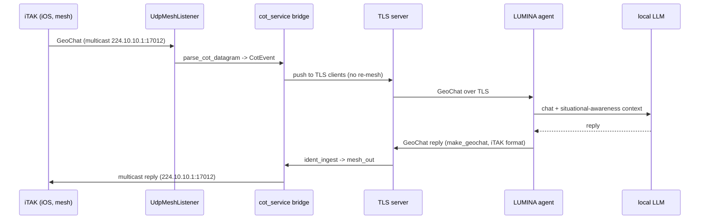

# CoT Bridge — ATAK/iTAK on the SKFed sovereign net

**Status:** LIVE (2026-06-22). Epic `c26e6fe9` / CoT sprint `4567c000` (CB1–CB5).

The CoT bridge lets real **TAK clients** (ATAK on Android, iTAK on iOS, WinTAK) join a
SKFed node and exchange **Cursor-on-Target** (positions, GeoChat, markers) over our own
backend — **no TAK Server, no shared-cert data-package PSK**. Per-device **capauth/PKI
identity** on the TLS side, **mesh multicast** bridged in for clients that only do mesh,
and an **AI teammate (LUMINA)** that reads GeoChats and answers with live situational
awareness — the thing the military's TAK stack cannot do. See the strategic context in
[`tak-vs-skfed-analysis.md`](tak-vs-skfed-analysis.md).

## Capability proven
- Android **ATAK** (phone + tablet) ↔ node over **TLS :8089** with per-device client-cert identity (TOFU-pinned).
- iOS **iTAK** ↔ node over **mesh** (UDP multicast, no server/auth) — position reliably, chat best-effort (see Known Issues).
- **LUMINA** AI agent: reads inbound GeoChats → local LLM → replies as a unit on the map; tracks unit positions for ground-truth answers.
- Everything bridged into one shared picture: TLS clients ⇄ mesh clients ⇄ federation peers.

## Architecture



### Message lifecycle — iTAK (mesh) chats LUMINA



## Modules (`src/skcomms/`)
| File | Role |
|---|---|
| `cot.py` | CoT codec — `parse_cot`/`to_cot`, `parse_cot_datagram` (XML + protobuf via `takproto`), `CotEvent`/`CotPoint`, `make_geochat`, `cot_to_envelope`/`envelope_to_cot` |
| `cot_server.py` | `CotStreamServer` (TCP/XML stream, rebroadcast, **ping/pong** keepalive, **initial state-sync** on connect), `TlsCotStreamServer` (TLS + client-cert→identity TOFU), `UdpMeshListener` (multi-group join, **send_cot**, **periodic IGMP re-join**), `federation_ingest` |
| `cot_service.py` | Runnable bridge: TLS + plain + mesh, wires TCP fabric ⇄ mesh both ways (no echo), inbox→inject, `mesh_out` |
| `cot_pki.py` | CA / server / per-device certs (legacy PBESv1 p12 for ATAK), ATAK/iTAK **data-package** generator, client-cert→identity, SNI cert support |
| `cot_client.py` | Headless TAK test client (Linux "operator") |
| `cot_agent.py` | LUMINA AI agent — GeoChat→LLM→reply, unit-position tracking for ground-truth answers |

## Services (systemd `--user`, all enabled / persistent)
| Unit | Purpose | Bind |
|---|---|---|
| `skcomms-api.service` | SKFed federation API (`/api/v1/inbox`) | `0.0.0.0:9384` (tailnet) |
| `skcomms-cot.service` | CoT bridge (TLS :8089, plain :8087, mesh :6969+:17012) | `0.0.0.0` + LAN iface `192.168.0.158` for mesh |
| `skcomms-cot-agent.service` | LUMINA AI agent | TLS client to `100.108.59.57:8089` |

Key env (in `skcomms-cot.service`): `SKCOMMS_COT_TLS=1`, `SKCOMMS_COT_TLS_PORT=8089`,
`SKCOMMS_COT_MESH_IFACE=192.168.0.158`, optional `SKCOMMS_COT_SNI_CERT/KEY/NAME` (Let's
Encrypt cert via tailscale, served by hostname for strict clients).

## Operations — enroll a device
```bash
# mint a data package for a device (LAN or tailnet host)
SKCOMMS_HOME=~/.skcapstone/skcomms ~/.skenv/bin/python -m skcomms.cot_pki package <device> --host 192.168.0.158
# -> ~/.skcapstone/skcomms/cot-pki/packages/<device>.zip  (import into ATAK)
```
- **Android ATAK:** import the `.zip` (☰ → Import) → auto-configures server `192.168.0.158:8089:ssl` + cert → connects.
- **iOS iTAK (mesh path):** Settings → Mesh enabled; same WiFi as the node; positions/chat ride multicast (best-effort).
- **PKI lives at** `~/.skcapstone/skcomms/cot-pki/` — CA key + device keys are **secret** (ignored from Syncthing via `.stignore`).

## Known Issues (to address later)
1. **iOS/iTAK mesh chat is best-effort.** Position is reliable; GeoChat is intermittent because it
   rides UDP multicast subject to **IGMP-snooping timeouts**, **iOS multicast throttling**, and
   **wired↔WiFi multicast forwarding** quirks on consumer APs. Mitigated by periodic IGMP re-join
   (90s) + initial state-sync, but not fully deterministic. **Proper fix:** get iTAK onto the **TLS
   server** path (reliable, connection-oriented) — blocked today by iTAK's cert-trust/auth handling
   (it ignores the iOS system trust store and wants its own data-package truststore, which hasn't
   imported cleanly on the test device). Now that **state-sync + ping/pong + a stable (non-flapping)
   cert** are in place, a fresh iTAK-TLS attempt is the path.
2. **LUMINA is not a direct-chat contact on iTAK.** Her position from the wired box reaches iTAK, but
   iTAK direct (unicast) chats target a contact endpoint LUMINA doesn't advertise. Use **All Chat
   Rooms** (broadcast) for now. **Fix:** advertise a reachable `<contact endpoint>` in LUMINA's PLI.
3. **`from_capauth()` default path** is `~/.capauth` (not SKAGENT-aware); `send_federated` works around
   it by resolving `~/.skcapstone/agents/<agent>/capauth`. Other callers may need the same.
4. **No mesh→mesh dedup vs TLS.** A device on both mesh and TLS (e.g. ATAK) can be seen twice; benign
   (last-writer-wins per uid) but worth a dedup pass.
5. **`tailscale cert` (LE) for the hostname expires (~90d)** — needs a renewal cron if the SNI/hostname
   path is used in production.
6. **Local LLM `.100:8082` can wedge** (Arc-iGPU corruption → garbage output); a restart of
   `skai-beellama.service` clears it. LUMINA should fall back to a secondary LLM endpoint.

## Tests
`tests/test_cot_codec.py`, `tests/test_cot_server.py`, `tests/test_cot_pki.py` — codec round-trips
(PLI/GeoChat/marker + protobuf mesh), TLS handshake + client-cert identity, ping/pong, state-sync,
data-package structure, federation ingest fan-out. Run: `cd ~ && python -m pytest <repo>/tests/test_cot_*.py -q`.
