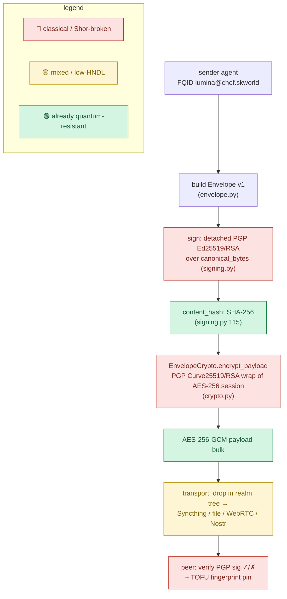
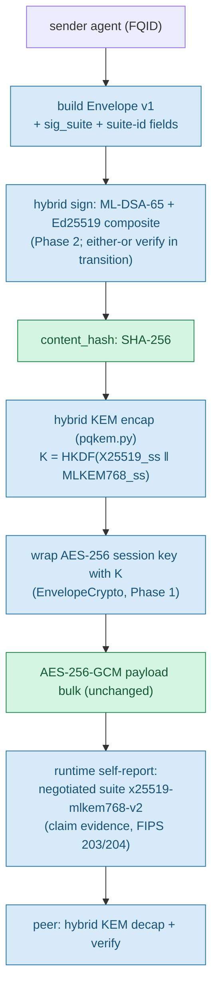
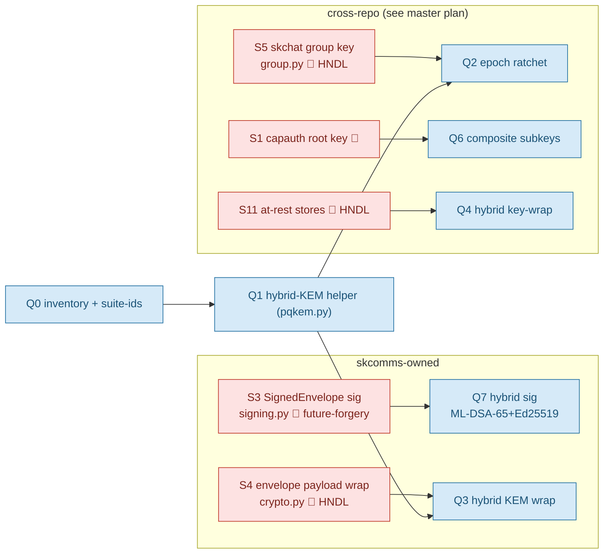

# skcomms — Cryptography Architecture & Quantum-Resistance

**Status:** Documentation of current state + target state. **Docs-only** — code lands under epic `PQC-MIGRATION` (coord `e1d6ba2a`).
**Master plan:** [SK Ecosystem — Quantum-Resistance Architecture & Migration Plan](../../skchat/docs/quantum-resistance-architecture.md) (source of truth).
**Standards anchor:** FIPS 203 (ML-KEM), FIPS 204 (ML-DSA), FIPS 205 (SLH-DSA); NIST CSWP 39 (crypto-agility); RFC 9580 + draft-ietf-openpgp-pqc-17 (OpenPGP PQC composites).

> This file describes the crypto surfaces **skcomms owns** — the `SignedEnvelope`
> signature (`signing.py`) and the envelope payload wrap (`crypto.py:EnvelopeCrypto`).
> For the SK-wide identity/key-flow and the full phased plan, read the master plan above.

---

## 1. Honest claim status (read first)

The single rule: **every quantum-resistance claim must cite the surface + the FIPS
number + hybrid-vs-classical, and be backed by a runtime self-report.** No claim
without evidence.

### What we CAN truthfully claim TODAY (pre-Phase-1)

- **"skcomms' content-integrity hashing is already quantum-resistant."** SHA-256
  (`signing.py`) is Grover-only (worst case half the bit-strength → still ≥128-bit).
  True now, no migration needed.
- **"AES-256-GCM payload bulk encryption is already quantum-acceptable."** Symmetric;
  Grover-only. We do **not** touch it.

### What we MAY claim ONLY AFTER Phase 1 (KEM/HNDL shipped)

- "skcomms envelope payload confidentiality is protected by hybrid post-quantum
  key encapsulation — X25519 + ML-KEM-768 (FIPS 203). A recorded ciphertext stays
  secret unless *both* X25519 and ML-KEM-768 are broken." — claimable **only once**
  `EnvelopeCrypto` uses the hybrid combiner AND the runtime self-report proves the
  negotiated suite per channel.

### What we MAY claim ONLY AFTER Phase 2 (signatures)

- "skcomms `SignedEnvelope` is authenticated with hybrid post-quantum signatures
  (Ed25519 + ML-DSA-65, FIPS 204)."

### NEVER say these (overclaiming)

- ❌ "quantum-proof" / "unbreakable" / "quantum-safe encryption" — the defensible
  word is **"quantum-resistant"** / **"post-quantum,"** never "-proof."
- ❌ "end-to-end quantum-resistant" while any leg is classical (tailnet handshake,
  CF→origin, PGPy-signed envelopes).
- ❌ "PQC" when only signatures migrated — does nothing for Harvest-Now-Decrypt-Later (HNDL).
- ❌ "CNSA 2.0 compliant" — we use the **-768 hybrid tier**, not the CNSA level-5 ceiling.
- ❌ Implying **AES-256 is "broken" by quantum** — it is not. Grover halves it to ~128-bit, safe.

---

## 2. The threat model in one line

The urgent problem is **HNDL** against *confidentiality* surfaces: an adversary
records ciphertext **today** and decrypts it after a CRQC exists (plausibly the
early-to-mid 2030s). Signatures are **not** retroactively breakable, so the
envelope-signature migration is real but **deferrable to Phase 2**. We act first on
the payload-wrap key exchange (Phase 1).

---

## 3. CURRENT (as-is) — how skcomms crypto works today

Every edge is labelled by quantum status:
🔴 = classical, Shor-broken (urgent if it carries long-lived confidentiality);
🟡 = mixed / low-HNDL-value; 🟢 = already quantum-resistant (symmetric/hash).



| Surface (file) | Today | Quantum status |
|---|---|---|
| `SignedEnvelope` signature (`signing.py:91-116`) | PGPy detached Ed25519/RSA over `canonical_bytes()` | 🟡 hash fine; **sig forgeable** post-Q for a known pubkey (future-forgery, not HNDL) |
| content-integrity hash (`signing.py:115`) | SHA-256 | 🟢 Grover-only, fine |
| envelope payload wrap (`crypto.py:EnvelopeCrypto.encrypt_payload`) | PGP Curve25519/RSA wrap of an AES-256 session key | 🔴 **HNDL** — recorded ciphertext retroactively decryptable |
| payload bulk cipher | AES-256-GCM | 🟢 keep, do not touch |
| transport (Syncthing/file/WebRTC/Nostr/tailnet) | classical handshakes, symmetric bulk | 🟡 handshakes vulnerable (external dep); bulk ciphers fine |

---

## 4. FUTURE (target) — hybrid PQ skcomms

The **universal combiner (never deviate):**

```
shared_key = HKDF-SHA256( X25519_shared_secret || ML-KEM-768_shared_secret,
                          info = "<context-label>" )
```

Concatenate-then-KDF. **Never XOR, never replace** classical with PQ. Secure if
*either* primitive holds. This is exactly TLS `X25519MLKEM768` and Signal PQXDH.



| Surface | Target + hybrid construction | Library path | Phase |
|---|---|---|---|
| `SignedEnvelope` signature | ML-DSA-65 + Ed25519 hybrid sig; add `sig_alg`/`sig_suite` field | liboqs-python ML-DSA **or** Sequoia | 2 (Q7) |
| envelope payload wrap | `K = HKDF(X25519_ss ‖ MLKEM768_ss)`; AES-256-GCM bulk unchanged | liboqs-python ML-KEM-768 + pyca X25519 | 1 (Q3) |
| hybrid-KEM helper | new `skcomms/pqkem.py` — `hybrid_encap` / `hybrid_decap` | liboqs-python + pyca/cryptography | 1 (Q1) |
| suite registry | `skcomms/crypto_suites.py` maps `suite_id → {kem, sig, kdf, aead, params}` | config-driven, never hard-coded | 0 (Q0) |

**Downgrade protection:** PQ material is optional until **both** peers advertise
support (a *signed* capability flag, never an unauthenticated header), then **locks
in for the session** — exactly how Signal shipped SPQR back-compatibly.

---

## 5. GAPS / remediation — vulnerable surfaces → fix

The master plan enumerates **11 vulnerable surfaces (S1–S11)** across the ecosystem.
skcomms owns **S3** and **S4**; the rest are cross-referenced here so the full
remediation path is visible from this repo.



| # | Surface (skcomms) | Today | Quantum status | Target | Sprint |
|---|---|---|---|---|---|
| S3 | `SignedEnvelope` signature (`signing.py:91-116`) | PGPy detached Ed25519/RSA over `canonical_bytes()` + SHA-256 | 🟡 hash fine; sig forgeable post-Q | ML-DSA-65 + Ed25519 hybrid sig; add `sig_alg` field | Q7 (Phase 2) |
| S4 | envelope payload encryption (`crypto.py:EnvelopeCrypto.encrypt_payload`) | PGP Curve25519/RSA wrap of AES-256 session | 🔴 **HNDL** | Hybrid KEM wrap `K = HKDF(X25519 ‖ MLKEM768)`; AES-256-GCM bulk unchanged | Q3 (Phase 1) |

Agility prerequisites shared with the rest of the ecosystem (Q0): a machine-readable
`sig_suite` on `SignedEnvelope`, a suite registry (`crypto_suites.py`), and the
backend-abstraction ABC extended across `signing.py` / `crypto.py`.

---

## 6. The browser / Flutter PQC gap (constrains S4)

- **WebCrypto has NO PQC API in any browser (2026).** A browser/PWA client cannot
  get app-layer ML-KEM from the platform — so any web leg that wraps payloads with
  a hybrid KEM cannot do so natively in-browser.
- **Native (Flutter Android/iOS/desktop): SOLVED** via FFI (`oqs` / `mlkem_native`
  binding liboqs) — but the liboqs native binary must be shipped per-platform in CI.
- **Web options (in order of preference):** (1) WASM build of liboqs/mlkem-native
  vendored into the PWA — workable, we own the audit risk; (2) pure-Dart/JS ML-KEM —
  more audit risk, avoid; (3) server-side KEM with capability-gated downgrade — the
  web client advertises *no* PQ capability and a daemon performs the hybrid KEM over
  a PQ-TLS channel; honest, but the web leg's E2E PQ property is **weaker and must be
  disclosed in the claim.**
- **Open decision (not decided here — surfaced for Chef):** native-only PQ now (the
  recommendation), WASM-liboqs later, or a non-Flutter client. Until resolved,
  **native clients get full hybrid KEM and the web PWA is documented as a
  reduced-assurance leg.** No claim may imply the browser is E2E PQ.

See the master plan §3.1 and §7 for the full tradeoff.

---

## 7. Cross-links

- **Master plan / source of truth:** [`../../skchat/docs/quantum-resistance-architecture.md`](../../skchat/docs/quantum-resistance-architecture.md)
- **skchat crypto view:** `../../skchat/docs/crypto-architecture.md`
- **capauth crypto view:** `../../capauth/docs/CRYPTO_SPEC.md` (+ identity/key-flow)
- **Ecosystem standard:** SKStacks `docs/CRYPTOGRAPHY_STANDARD.md`
- **Epic:** `PQC-MIGRATION` (coord `e1d6ba2a`), tag `quantum-resistance` — runs
  alongside the comms-suite epic, side-tabbable.
