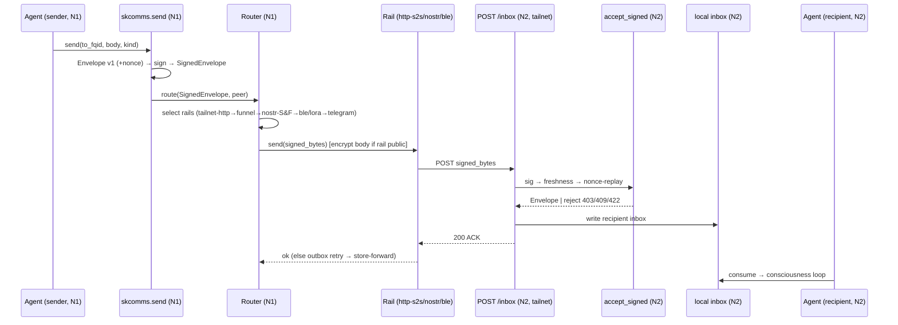

# Federation Data-Comms Architecture — design analysis (2026-06-22)

**Question (Chef):** what's the right way to sync/communicate between federated sovereign
nodes? Should every agent have copies of all messages on all nodes? (No.) Do we need a
pub/sub layer like Mastodon/ActivityPub?

## 1. What's wrong today (symptoms I hit while debugging)
- **Brute-force state replication.** Syncthing mirrors **all of `~/.skcapstone`** bidirectionally
  between .158 and .41 — 118k files: *every* agent's memory, sessions, soul, identity, secrets.
  Jarvis's box holds Lumina's entire mind and vice-versa. Doesn't scale, leaks data across
  agents/nodes, and creates write-conflict risk on live SQLite/JSON.
- **No real message transport between nodes.** Peer registry entries carry only a *local* dead-end:
  `transport_addresses: {file: "file:///home/cbrd21/.skcomm/inbox"}`. "Sending" to a remote agent
  writes to the *sender's own* local inbox. Nothing crosses the network. (Confirmed: live
  jarvis↔lumina message test delivered nothing.)
- **Split stack.** .158 runs the legacy `skcomm` daemon (no receive API); .41 runs new `skcomms`
  (FastAPI, but bound to `127.0.0.1` — unreachable by peers). 6,556 stuck file-outbox items + corrupt
  old-format outbox entries.
- **What's already RIGHT (the template):** the **media/call plane** — per-node LiveKit SFU + on-demand
  capauth-signed **cross-realm token mint** (`/conf/{room}/federated-token`) + **Nostr relay discovery**
  of SFU foci. No replication; targeted, signed, on-demand. We should mirror this everywhere.

## 2. Principles for the target architecture
1. **Owner-centric, home-node authoritative.** Each agent has a home node; its mind (memory/
   sessions/soul/secrets) lives there and is NOT copied to nodes that don't run it.
2. **Targeted delivery, least replication.** A message exists only on the sender's node (sent copy)
   and each recipient's node (inbox copy). Non-participants get nothing.
3. **Signed + verifiable.** Every cross-node payload is capauth-signed; receiver verifies against the
   pinned/discovered pubkey (we already do this for SFU tokens).
4. **Reuse existing primitives.** capauth (sign/verify/trust), the Nostr relay (already running),
   skcomms outbox (retry/backoff), LiveKit federation (reference pattern). Don't invent new infra.
5. **Separate the planes** — different data, different transport, different replication policy.
6. **Files NEVER sync between hosts.** A file lives on exactly one host; the **PG index is the
   authoritative location directory** — every indexed row carries `{host/node, path}` so a query
   resolves *where* the file is, and the LLM/app fetches/edits it **in place** on that host (via the
   host's file MCP), then re-indexes. No corpus replication, ever. (Schema: `docs` table needs a
   `node`/`host` + canonical `path` column; today it has `source` — extend it.)

## 3. The five planes

| Plane | Data | Transport | Replication policy |
|---|---|---|---|
| **Identity / discovery** | `agent@node` → home-node URL + capauth pubkey + capabilities | **Nostr relay** (pub/sub) + signed directory records; WebFinger-style resolve | Published; any node may cache. Small, public-ish. |
| **Message** (1:1, groups) | chat messages, files | **ActivityPub-style S2S**: sender node POSTs a capauth-signed envelope to the *recipient* node's inbox endpoint (`POST https://<node>/api/v1/inbox`); receiver verifies + stores | Targeted. Only sender + recipient nodes hold it. **No global copies.** |
| **Presence / availability** | online/offline, heartbeat, "agent X is on node Y" | **Nostr pub/sub** (ephemeral events) | Broadcast, ephemeral, not persisted. |
| **State / memory** | per-agent memory, sessions, soul, secrets | Syncthing (or restic) **scoped to that agent's own instances only** | Per-agent. An agent's home replicates only to *its own* other instances, never cross-agent. |
| **Media / calls** | RTP/screenshare | LiveKit SFU per node + cross-realm signed token mint + Nostr SFU discovery | **DONE.** On-demand, targeted, signed. The reference. |

## 4. Recommended model — hybrid: ActivityPub S2S + Nostr pub/sub
This is exactly the Mastodon intuition, adapted to what we already run:
- **Private messages → ActivityPub-style server-to-server** (targeted signed POST to the recipient
  node's inbox). NOT broadcast. This is the missing "message plane" — replace the file:// dead-end
  with `https://<recipient-node>/api/v1/inbox` delivery; skcomms outbox does the retry/queue;
  capauth signs; the receiving node's skcomms API (bound to **tailnet/funnel**, not localhost)
  verifies + drops into the local agent's inbox; the agent's daemon picks it up.
- **Discovery + presence + public/broadcast → Nostr** (we already run `skchat-nostr-relay`). Publish:
  agent→node directory, pubkeys, presence, "focus" SFU descriptors (already done for calls). Nostr IS
  a federated pub/sub relay — it's the "Mastodon-like" bus, and it's already here.
- **Trust:** capauth `federation-trust.json` + pinned/discovered pubkeys gate who may deliver to whom
  (already built for SFU).

### Answering "should all agents have all messages on all nodes?"
**No.** A node holds: (a) its local agents' inboxes/outboxes, (b) a *cache* of the public discovery
directory, (c) presence it cares about. It does **not** hold other agents' private messages or minds.
Group messages fan out to each member node's inbox (with an optional shared-inbox optimization).

## 5. Migration path (from today's broken state)
1. **Stop full-`~/.skcapstone` replication.** Split Syncthing into:
   - a tiny **shared** folder (peer registry, `federation-trust.json`, pinned pubkeys, `cluster.json`)
     — or better, publish these via Nostr and stop syncing them;
   - per-agent homes → sync only to that agent's own instances.
2. **Standardize both nodes on new `skcomms`** (retire legacy `skcomm`); run the skcomms API bound to
   the **tailnet** (not localhost), reachable peer-to-peer (firewalld tailscale0=trusted already fixed).
3. **Implement the S2S inbox delivery transport** in skcomms: peer `transport_addresses` →
   `https://<node>/api/v1/inbox`; signed POST; verify+store on receipt; outbox retry for offline.
4. **Migrate old/corrupt outbox + the 6,556 backlog** to the new envelope format (or archive+drop the
   un-routable ones — most are local dead-ends with no real destination).
5. **Discovery via Nostr:** publish each agent's directory record (fqid→node→pubkey) on startup;
   resolve peers from Nostr instead of the static file registry.

## 5b. Compatibility across ALL skcomms rails (hard constraint)
skcomms is already a **multi-rail transport bus** (`transport.py` file/http, `pubsub_transport.py`,
`transports/lora/`, the Telegram adapter, …). Federation must NOT bypass or fork that — it layers on top:

- **One canonical signed envelope, rail-independent.** A message is `{from_fqid, to_fqid, kind,
  body, ts, nonce, sig}` — identical bytes whether it travels over tailnet-HTTP, the Nostr/pubsub
  relay, LoRa, the Telegram bridge, or a local file drop. capauth signs the envelope, not the rail.
  Any rail can carry it; any node can verify it. (Migrate the old/corrupt entries INTO this envelope.)
- **A transport ROUTER selects the rail per-peer, per-availability** — it does not hardcode one.
  Discovery advertises *which rails a peer is reachable on*; the router tries them in priority order
  with fallback, e.g.: tailnet-HTTP (direct, S2S inbox) → funnel-HTTPS → **pubsub relay (store-&-forward
  when the peer is offline/NAT'd)** → LoRa (off-grid) → Telegram bridge. Same envelope on every rail.
- **Nostr/pubsub is itself just a rail** (`pubsub_transport.py`) — used for discovery + presence +
  broadcast AND as the offline store-and-forward path. It is not a separate system bolted on.
- **The S2S "inbox" is the HTTP rail's receive endpoint**, but the inbox *accepts the canonical
  envelope from any rail* (LoRa gateway, Telegram inbound, file) and processes it identically.
- **Backwards-compatible:** keep the file rail (local same-box delivery), keep Telegram/LoRa rails.
  We only (a) FIX the http rail to be node→node (not local dead-end), (b) add the router + discovery,
  (c) standardize the envelope so every rail interops. Nothing existing is removed.

Net: "federation" = *routing the canonical signed envelope to the recipient's home node over the best
available skcomms rail*, with the rails unchanged and pluggable.

## 6. Decisions for Chef
- **A. Commit to the hybrid (ActivityPub-style S2S messages + Nostr pub/sub discovery/presence)?**
  (Recommended — minimal new infra, reuses capauth + the running Nostr relay + the proven LiveKit
  federation pattern.)
- **B. Sync scope:** narrow Syncthing to per-agent + a tiny shared folder, OR move shared
  config to Nostr/discovery entirely and drop cross-node Syncthing for `~/.skcapstone`?
- **C. Build vs adopt:** implement S2S inside skcomms (we own it, fits capauth/Nostr), vs. adopt an
  actual ActivityPub/Matrix server. (Recommend build-in-skcomms — we already have 80% of the parts.)

## 7. DECISIONS LOCKED (Chef, 2026-06-22)
- **A → Build into skcomms.** Rail-agnostic canonical signed envelope + transport router + S2S HTTP
  inbox rail + Nostr pub/sub (discovery/presence/store-forward). Reuse capauth + Nostr relay + outbox
  + LiveKit-federation pattern. Keep ALL existing rails (file/http/pubsub/lora/telegram) compatible.
- **B → Per-agent + tiny shared folder.** Stop full `~/.skcapstone` mirroring; sync each agent's home
  only to its own instances; one tiny SHARED folder (peer registry, federation-trust, pinned pubkeys,
  cluster.json).
- **C → Nostr relay store-and-forward** for offline/NAT'd delivery (router fallback after direct rails).

## 7b. Access plane — dev tools, phones, and the memory hub (Chef Qs, 2026-06-22)

**Q: Claude Code/OpenCode/Codex on machine X using Lumina's profile (memory, MCPs, whisper) that
lives on .158 — how?** → **Remote MCP over Tailscale, NOT 0.0.0.0-LAN.**
- An agent's tools (skmemory, skcapstone, skchat, …) run as MCP servers on its **home node**, served
  over **HTTP/SSE bound to the tailnet** (FastMCP supports SSE), **capauth-gated**. A dev tool on any
  machine (on the tailnet, from anywhere) points its MCP config at
  `https://<home-node>.ts.net/<agent>/mcp/<server>` and *is* that agent — tools + data stay home; the
  client just connects. Whisper/soul/context resolve server-side on the home node.
- Why Tailscale not 0.0.0.0: secure + authenticated + works from anywhere (not just LAN), no broad
  exposure. (A LAN-only box would just join the tailnet.) 0.0.0.0 + file-population invites multi-writer
  corruption — avoid.

**Q: should skmemory be hub-and-spoke?** → **YES — this is the key refinement.**
- **Memory is a HUB SERVICE, not synced files.** The authoritative store lives on the agent's home node
  (the `skmem-pg` Postgres/pgvector already on .158); **spokes** (dev tools, app, other instances)
  **read AND write THROUGH the hub** via the skmemory MCP/API over Tailscale. Single writer-of-record =
  no sync conflicts. This **replaces file-sync for the memory plane** (kills the Syncthing-everything
  problem for memory) — refines P5: memory via hub-spoke service; only static config/identity/soul/keys
  sync per-agent.
- Spokes may keep a **local read cache** (offline/perf); writes always go to the hub (queued in the
  app/tool outbox when offline, flushed on reconnect — same envelope/outbox pattern as messages).

**Q: phone Flutter app offline (PWA "install to desktop/home screen")?**
- The Flutter web app is a **PWA** (service-worker cached). Once installed, the **app shell loads
  offline**; it's **local-first** (already uses Hive): read previously-synced chats, compose, and the
  outbox **queues sends** until back online. Calls (LiveKit) need network — except…
- **Offline-proximity = the BLE rail.** skcomms has a Bitchat-inspired **BLE proximity mesh** rail; with
  .41's Bluetooth, phone↔.41 / phone↔phone can exchange the *same canonical envelope* over BLE when
  there's no internet. It's just another rail the router can pick — fits the rail-agnostic design.
- So: offline = read cache + queue + (optional) BLE proximity; online = full S2S + calls. The hub-spoke
  memory means an offline spoke uses its cache and syncs writes to the hub on reconnect.

## 7c. Knowledge / corpus plane — skos (pgvector+graph + managed files), Chef Q 2026-06-22
Goal: any local LLM (Claude Code/OpenCode on .158 or .41) does a lookup in pg (vector/BM25/graph) →
gets back the indexed **files** (which may live on .158 and/or .41) → can **read AND write** them on the
filesystem skos manages, with the index staying in sync. This is the same hub-spoke + access-plane
pattern applied to knowledge.

**Two coupled hubs, exposed over Tailscale (capauth-gated):**
1. **Query hub = skmem-pg** (pgvector + ParadeDB BM25 + Apache AGE graph, already on .158; engine
   mirrored on .41). Exposed via the **skmemory MCP/API** (already does hybrid vector+BM25 search over
   the `docs` corpus). Extend it to (a) run AGE **graph** queries, (b) return **node-qualified file refs**
   (`{node, path, score, snippet}`) — i.e. the result says *which node + path* holds the source file.
2. **File hub = skos-managed corpus** (wiki/docs/ingested files). Exposed as a **file MCP/API**
   (`list / read / write / search`), capauth-gated, served **per node** (each node serves its own files;
   the query hub's refs are node-qualified). **Write-through:** a write goes via skos → file on disk →
   **re-index into skmem-pg** (the existing skingest pipeline on write/watch) so the index never drifts.

**The flow Chef described:**
`Claude Code (.41)` → skmemory MCP query (vector/graph) over Tailscale → results: `[{node:.158, path:wiki/x.md,…},{node:.41, path:docs/y.md,…}]` → fetch each via that node's **file MCP** (read) → edit →
**write via file MCP** → skos re-indexes → next query sees the update. R/W to the exact files skos
manages, from any machine, no full file replication.

**Topology choice:** single knowledge **hub on .158** (everything indexed there; .41 is a query spoke +
serves its own files on demand) vs **per-node corpus** (each node indexes its own files; federated
fan-out query merges results). Single-hub is simpler now (only .158's skmem-pg is populated; .41's is an
empty mirror); per-node is the federated end-state. Recommend **single-hub now, per-node-ready schema**
(node-qualify every ref so we can light up .41's index later without changing callers).

**Exposure mechanism:** **skos file MCP/API** (controlled, capauth-gated, write-through re-index,
cross-node) as the primary R/W path — NOT a raw network mount (mounts give no re-index hook, weak
locking/perf). Optional **read-only SSHFS-over-Tailscale** later for bulk human browsing. (Same
"Tailscale not 0.0.0.0" rule as the rest of the access plane.)

Ties to the existing **skos** umbrella (epic `1b4ab47a`) + **skingest** (the sole ingestion pipeline) +
the access plane (P7). New phase **P8** below.

## 7d. The capstone — Flutter app as the skos OS client (Chef, 2026-06-22)
Ultimate goal: **run skos from the Flutter app and reach ALL files + services on every machine running
our stack.** The Flutter app becomes the **sovereign OS shell**; every node is a backend; Tailscale is
the fabric; capauth is identity. Everything designed above is what the app consumes:

```
   ┌─────────────────────  Flutter skos OS app (phone / desktop PWA)  ─────────────────────┐
   │  Chat · Calls/Conf · Spaces · Cluster(skbloom) · Coord · [NEW] Files · [NEW] skos ctrl │
   └───────────────────────────────────┬───────────────────────────────────────────────────┘
                       access plane (MCP/HTTP over Tailscale, capauth-gated)
   ┌───────────────────────────────────┴───────────────────────────────────────────────────┐
   │ message plane (S2S+Nostr) │ memory hub (skmem-pg) │ knowledge+files (skos: pg query + file MCP) │ media (LiveKit) │
   └───────────────────────────────────────────────────────────────────────────────────────┘
        nodes: lumina@.158 · jarvis@.41 · … (each serves its own files/memory; index node-qualified)
```

- The app already has Chat/Calls/Conf/Spaces/**Cluster control (skbloom)**/Coord. **Add two surfaces:**
  a **Files** browser (search via pg vector/graph → open node-qualified files → read/write via the skos
  file MCP, write-through re-index) and a **skos control** surface (manage the OS/services per node).
- Backed entirely by the **access plane (P7)** + **knowledge plane (P8)** — no new transport; the app is
  just another spoke. Works from anywhere on the tailnet; offline = PWA cache + write-queue + BLE.
- This is the convergence of [[skchat-unified-client-federation]] (the one client), [[skfed-comms-architecture]]
  (the fabric), and the **skos** umbrella (epic `1b4ab47a`).

## 9b. Detailed P1/P2 build spec (arch hat — the swarm builds to this)
**skcomms-in-place is MAINTENANCE MODE** (Chef 2026-06-22): build the strategic path cleanly —
canonical `SignedEnvelope` is THE federation wire format; no dual-path/back-compat gymnastics. Legacy
`MessageEnvelope` stays only where non-federation local code still needs it; the federation send/receive
path uses Envelope v1 end-to-end.

### Message lifecycle (target)


### Component contracts (parallel-build units = swarm tasks)
- **S1 `transports/http_s2s.py : HttpS2STransport(Transport)`** (model on `transports/tailscale.py`):
  `name="https-s2s"`, REALTIME, priority above tailscale-tcp. `send(bytes, recipient)`: resolve
  `inbox_url` from `discovery.PeerStore` peer `transports[].settings.inbox_url`; POST bytes
  (`Content-Type: application/skcomms-signed-envelope+json`); 200→ok, 4xx→permanent, 5xx/timeout→retry.
  `receive()`→`[]`. Register in `core.BUILTIN_TRANSPORTS` + `create_transport`.
- **S2 `POST /api/v1/inbox`** (api.py): rename current GET `/inbox`→`/messages`; new POST → `SignedEnvelope.from_bytes`
  → `federation.accept_signed(verifier, nonce_cache)` → write to recipient agent's file-transport inbox →
  `{ok,id}`. Reject 403/409/422; per-sender rate-limit (`ratelimit.py`).
- **S3 Router rail ordering** (`router.py`): `_select_transports` honors peer-advertised ordered rail list
  ahead of global priority; federation default chain; store-forward (Nostr) fallback when all direct fail.
- **S4 Canonical send path** (`core.py`): `send()` builds+signs Envelope v1 (capauth key) → router gets
  `SignedEnvelope.to_bytes()`; outbox stores `SignedEnvelope`.
- **S5 Peer addressing** (`discovery.py`/`peers.py`/api `POST /peers`): `PeerInfo.transports` carries
  `{transport:"https-s2s",settings:{inbox_url}}` + ordered rails + pinned pubkey; `inbox_url_for(fqid)`;
  migrate `file://` dead-ends.
- **S6 Deploy** (both nodes): bind skcomms API to the **tailnet** (not 127.0.0.1; firewalld tailscale0=trusted);
  systemd env; seed peer `inbox_url`s (`https://noroc2027.ts.net/api/v1/inbox`,
  `https://cbrd21-laptop…ts.net/api/v1/inbox`).
- **S7 Queue reconcile + migration scaffold** (`outbox.py`): one federation queue; entries store
  `SignedEnvelope`; `migrate` old/corrupt `MessageEnvelope`→Envelope v1 (route deliverable, archive dead-ends).

### Bolstered elements (arch hat)
- **Per-rail confidentiality:** sign ALWAYS; **encrypt body on untrusted/public rails** (Nostr S&F→NIP-44;
  tailnet/TLS rails already encrypt).
- **Reliability/idempotency:** inbox 200=delivered; else exponential retry → store-forward; **nonce dedup
  makes retry + S&F idempotent.**
- **Groups:** fan-out one signed envelope per recipient node (shared-inbox later).
- **Observability:** `metrics.py` per-rail counters (sent/ok/fail/retry, queue depth, inbox accept/reject
  reason) at `/api/v1/status` + `/federation/status`.
- **Back-pressure:** per-sender inbox rate-limit + max envelope size.

```mermaid
flowchart LR
  App[Flutter skos OS app] -- MCP/SSE over Tailscale, capauth --> AP{{access plane}}
  AP --> MSG[messages: S2S+Nostr]
  AP --> MEM[memory hub: skmem-pg]
  AP --> KN[knowledge+files: skos pg-index + file MCP]
  AP --> MED[media: LiveKit]
  MSG --- N1[(lumina@.158)] & N2[(jarvis@.41)]
  MEM --- N1
  KN --- N1 & N2
  MED --- N1 & N2
```

## 8. Build plan (coord epic `skfed-comms`)
- **P0 Foundation/parity:** standardize both nodes on new `skcomms` (retire legacy `skcomm`), latest
  versions, GitHub-synced; skcomms API bound to tailnet (not localhost), reachable peer-to-peer.
- **P1 Canonical envelope + router:** define `{from,to,kind,body,ts,nonce,sig}` envelope (capauth-signed,
  rail-independent); transport router with per-peer rail selection + ordered fallback.
- **P2 S2S HTTP rail:** `POST /api/v1/inbox` (verify+store); sign+POST delivery to recipient node;
  peer `transport_addresses` file→`https://<node>/api/v1/inbox`.
- **P3 Discovery/presence via Nostr:** publish + resolve agent→node→pubkey directory; presence heartbeat.
- **P4 Offline store-and-forward:** router fallback → publish signed envelope to Nostr relay → recipient pulls.
- **P5 State-sync re-arch:** narrow Syncthing to per-agent homes + tiny shared folder.
- **P5 State-sync re-arch (REFINED):** memory is **hub-and-spoke** (authoritative skmem-pg on home
  node, accessed via skmemory MCP/API — NOT file-synced). Syncthing narrows to only static per-agent
  config/identity/soul/keys + a tiny shared folder. No memory file-sync.
- **P6 Migrate old messages + verify:** rewrite old/corrupt outbox → canonical envelope; E2E
  jarvis↔lumina online + offline + cross-rail; phones message across instances.
- **P7 Access plane (NEW):** serve each agent's MCP servers (skmemory/skcapstone/skchat…) over
  **HTTP/SSE bound to the tailnet, capauth-gated**, so Claude Code/OpenCode/Codex on ANY machine use
  that agent's profile (memory hub + tools + whisper) remotely. Spoke local read-cache + write-queue.
- **BLE rail (design-now/build-later):** the rail-agnostic router accommodates a BLE proximity rail
  (.41 Bluetooth, Bitchat-style) carrying the same canonical envelope for offline phone↔node↔phone;
  built/tested after the core S2S+Nostr+hub-spoke lands.
- **P8 Knowledge/corpus plane (skos):** extend `docs` index with `{node, path}` location columns
  (authoritative directory; **no file sync**); extend skmemory MCP with graph queries + node-qualified
  file refs; **skos file MCP** (`list/read/write/search`, capauth-gated, write-through re-index via
  skingest) served per node over Tailscale. Single-hub now (.158), per-node-ready schema.
- **P9 Flutter skos OS surfaces:** add a **Files** browser (pg vector/graph search → open node-qualified
  files → read/write via skos file MCP) + a **skos control** surface to the app. Consumes P7+P8; the app
  becomes the sovereign OS shell reaching all files/services on all nodes.

## 9. DECISIONS LOCKED #2 (Chef, 2026-06-22)
- **Memory = hub-and-spoke** (skmemory service on home node via MCP/API over Tailscale; spokes
  read+write through the hub w/ local cache + offline write-queue; stop file-syncing memory). Refines P5.
- **Access plane (P7) = remote MCP over Tailscale** (capauth-gated SSE), NOT 0.0.0.0-LAN. "Use Lumina
  from any machine" works by pointing the dev tool's MCP config at her home node.
- **BLE rail = design now, build later.**
- **Phones offline = PWA + Hive local-first** (read cache, queue sends) + BLE for offline-proximity.
