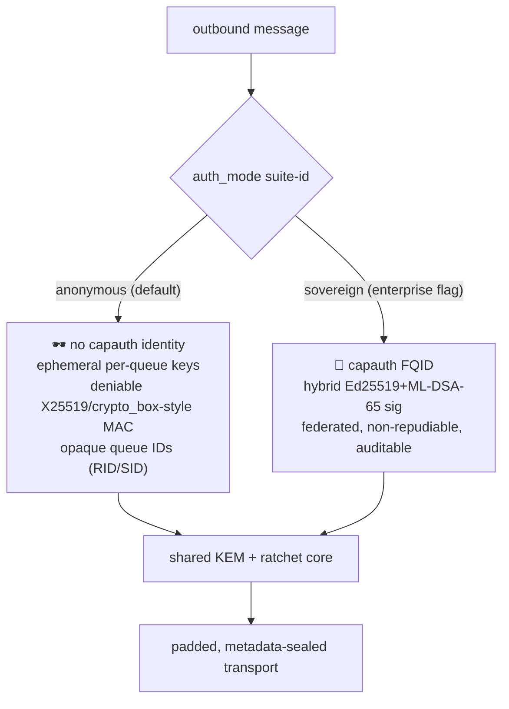
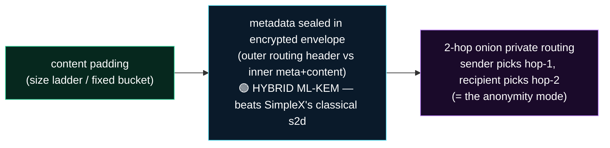
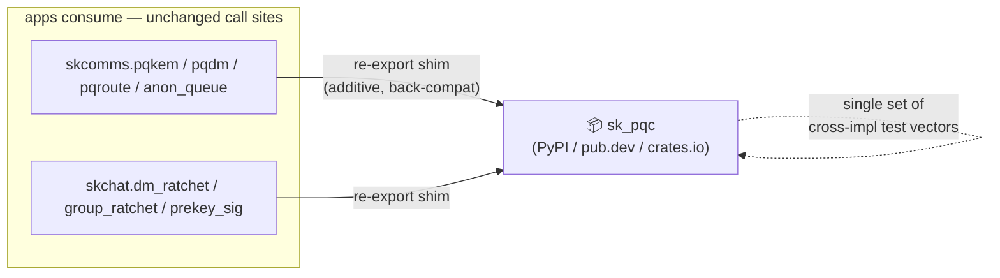
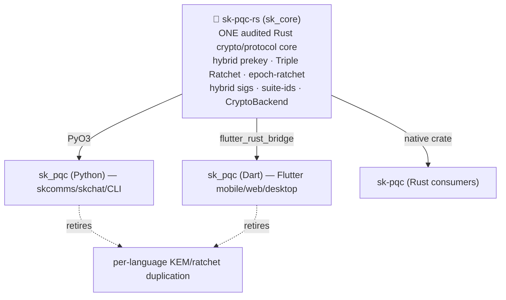

# RFC-0001 — Post-Quantum Ratchet, Metadata Privacy & Dual Identity

**Status:** Draft / for-implementation · **Date:** 2026-06-25 (refreshed 2026-06-27) · **Owners:** Chef & Lumina
**Repos:** skcomms (transport/envelope/routing) · skchat (DM/group ratchet, app) · capauth (identity) · sksecurity (self-report)
**Standards:** [sk-standards](https://github.com/smilinTux/sk-standards) (crypto / doc-SOP / data-flow). Honest-claim rules apply throughout.

> **2026-06-27 status delta:** the `sk-pqc` primitive family is now **published** (PyPI
> `sk-pqc`, pub.dev `sk_pqc`, crates.io `sk-pqc` — all import as `sk_pqc`). The scaffolds
> for P2 (padding), P3 (`pqroute1`), P4 (self-report), P5 (anon-queue) and the sovereign
> prekey-signature exist in-tree. The next moves are (a) **utilize** the published lib from
> skcomms/skchat via additive re-export shims (§6) and (b) **converge** on a single audited
> Rust core (§7 / P7). See the refreshed status table in §4.

> One sentence: **adopt the best ideas from SimpleX, Signal, Apple, and MLS — Level-3
> post-quantum healing, metadata privacy, and a no-identity anonymity mode — as new
> suite-ids and backends on our existing crypto-agility scaffolding, never a rewrite,
> and never by copying AGPL code.**

---

## 0. Clean-room & license guardrail (read first)

SimpleX (`simplexmq`, `simplex-chat`) and Signal's SPQR (`SparsePostQuantumRatchet`)
are **AGPL-3.0**. We are **Apache-2.0**. Therefore:

- ✅ **Read the public protocol specs, RFCs, and blogs for *ideas* and wire-shape** —
  algorithms, message fields, sizes, and design patterns are facts/methods, not
  copyrightable expression.
- ❌ **Never paste or close-paraphrase their source** (Haskell/Rust/Kotlin/Swift) into
  our tree — it would force AGPL onto skchat. Clean-room: reimplement from the *spec*,
  document independent derivation in commits.
- Apple PQ3 and IETF MLS are ideas/standards-only by nature (no AGPL code).

---

## 1. Why (grounded comparison)

| Design | PQ handshake | PQ *ongoing* ratchet | Groups | Metadata | Identity | Agility |
|---|:--:|:--:|:--:|:--:|:--:|:--:|
| **Signal PQXDH** | ✅ ML-KEM | ❌ (L2) | n/a | — | classical sig | — |
| **Signal SPQR / Triple Ratchet** | ✅ | ✅ per-msg, chunked+RS (L3) | — | — | classical sig | — |
| **Apple PQ3** | ✅ ML-KEM-1024 | ✅ periodic ~50msg/≤7d (L3) | — | — | classical ECDSA | — |
| **SimpleX** | ✅ sntrup761 | ✅ per-msg dual-KEM (L3) | ❌ (keygen) | 🥇 onion + padding + no-IDs | deniable **or** signed | ❌ hardcoded |
| **IETF MLS PQ (draft-04)** | ✅ | ✅ **per-epoch** | 🥇 TreeKEM O(log N) | — | classical **or** ML-DSA | suite-registry |
| **us (today)** | ✅ ML-KEM-768 (`pqdm1:`) | ❌ (L2) | ✅ epoch-ratchet | ⚠️ weak (signed envelopes) | 🥇 sovereign FQID + **hybrid ML-DSA sig** | 🥇 suite-ids + backend ABC + self-report |
| **us (this RFC)** | ✅ | ✅ **L3** | ✅ epoch (MLS-mapped) | ✅ padding + PQ-metadata + onion | 🥇 **dual: anon ↔ sovereign** | 🥇 |

**Takeaways that shaped this RFC:**
- Our `pqdm1:` prekey is already PQXDH (Level 2). Closing to **Level 3** is the clearest crypto win.
- **Per-message PQ doesn't scale to groups** (SimpleX admits sntrup761 keygen kills groups >10–20). MLS/TreeKEM and our **epoch-ratchet** are the right answer — *validated*.
- SimpleX leaves its **routing/metadata layer classical** — we can do **hybrid-ML-KEM on metadata** and *beat them on harvest-now-decrypt-later for metadata*.
- Our **hybrid Ed25519+ML-DSA-65 signatures are ahead** of PQ3 and the first seven MLS suites (still classical sigs).
- SimpleX already ships **deniable vs signed auth per-queue** → our **dual-identity switch is a proven design**, not a gamble.

---

## 2. Design

### 2.1 Dual identity — `auth_mode` is a suite-id, not an architecture

One envelope, one ratchet, one transport. The *identity layer* flips by a per-conversation
(or per-deployment-default) suite-id:



- **anonymous** (default) — SimpleX topology: pairwise opaque queue IDs, **no capauth identity**, **deniable** auth (no signatures on content), MITM-resisted by OOB/QR link exchange (secrets in the URI hash fragment, never sent to the relay).
- **sovereign** (flag) — our FQID + **hybrid Ed25519+ML-DSA-65** identity signature, federated, auditable.
- **Invariants (enforced + self-reported):** a *sovereign* conversation **never silently downgrades** to anonymous; signatures stay **off the ratchet steps** in both modes so **content deniability** survives even in sovereign mode (identity is asserted only at session establishment). `sksecurity` self-report declares the active mode + what the relay can/can't see.

### 2.2 Level-3 post-quantum ratchet for 1:1 DMs

Make `pqdm1:` (Level 2) into **Level 3** by adding a hybrid **ML-KEM-768** rekey to the
*ongoing* ratchet — a **Triple Ratchet** (our X25519 Double Ratchet **and** an ML-KEM
ratchet in parallel, **KDF-combined so an attacker must break BOTH**):

```
RK', CKx = KDF_RK( RK,  X25519(dh_self, dh_peer)  ||  ML-KEM_ss )   # concat-then-KDF, never XOR
```

ML-KEM `ss` is already the FIPS-203 FO-hashed 32 bytes (the implicit-rejection hash sntrup
lacks), so concat-then-KDF is safe and strictly hybrid. **Two delivery strategies** behind
one suite-id family:

- **`pqdr-periodic-v1` (ship first, interim):** Apple-PQ3-style — trigger a hybrid ML-KEM
  rekey **adaptively (~every 50 messages, guaranteed ≤ every 7 days)**. A few-line policy,
  earns Level 3 immediately, ~2.3 KB ek+ct only on rekey messages.
- **`pqdr-braid-v1` (later, continuous PCS):** Signal-SPQR-style — **chunk** the ML-KEM
  ek/ct across consecutive messages and reconstruct with **Reed-Solomon systematic erasure
  codes** (any N-of-M), so per-message overhead is small and loss/reorder-tolerant; new
  shared secret begins a new epoch. Tighter PCS window at higher engineering cost.

Cold-start gap: PQ engages after a round-trip each way. We avoid ever being classical-only
at message 1 by keeping the **`pqdm1:` hybrid prekey** (PQXDH) for session establishment.

### 2.3 Groups — epoch-amortized, MLS-mapped (keep & formalize)

Do **not** per-message PQ for groups. Keep our **epoch-ratchet**; pay the hybrid
ML-KEM-768 keygen/encapsulation **once per epoch** (membership delta / time / message
bound), **O(log N)** the MLS/TreeKEM way. Map our suite-ids onto MLS naming for
standards-traceability and negotiation, e.g.
`skc-mlkem768x25519-aes256gcm-sha384-mldsa65` ≈
`MLS_256_MLKEM1024_AES256GCM_SHA384_MLDSA87`'s lower-tier sibling. (MLS PQ ciphersuites
are draft-04, Informational — pin the draft, keep agility to renumber.)

### 2.4 Metadata privacy — tiered, cheapest first



1. **Content padding** *(low effort, do first)* — length-prefix + pad each envelope to a
   bucket **before** transport encrypt. Prefer a small **ladder** (e.g. 4/16/64/256 KiB)
   over SimpleX's single 16 KiB bucket (their bucket wastes bandwidth on small DMs; a
   ladder leaks only a coarse size class). Suite-flag `pad=ladder-v1` for the self-report.
2. **Metadata-in-encrypted-envelope** *(medium effort, best value)* — split envelope into an
   **outer routing header** (only what the next hop needs) and an **inner metadata+content**
   blob sealed to the destination with our **hybrid X25519+ML-KEM-768** KEM (new suite-id
   `pqroute1:`). Intermediate relays/federation nodes see neither the final FQID nor flags.
   *This is where we beat SimpleX* (they kept routing classical).
3. **2-hop onion private routing** *(high effort = the anonymity mode)* — sender chooses
   the forwarding node, recipient publishes the destination node; per-hop ephemeral hybrid
   KEM; the forwarding node **re-encrypts outbound** so no ciphertext/identifier is common
   in/out (the f2d traffic-correlation defense, even if TLS breaks).
4. **Transport:** TLS 1.3 only; bind the app session with **RFC 9266 `tls-exporter`** (not
   SimpleX's `tls-unique`, which is TLS≤1.2 semantics).

> **Honest scope:** over a *small sovereign tailnet* the anonymity set is tiny → weaker
> unlinkability than SimpleX's public relay pool. The self-report must say so; never claim
> Tor-grade anonymity on a 3-node net.

### 2.5 Architecture — one shared crypto core (the core-library pattern)

Mirror SimpleX's shared-core design: **one audited crypto/protocol core** (our hybrid
prekey, Triple Ratchet, epoch-ratchet, hybrid sigs, suite-ids, `CryptoBackend` ABC) compiled
**native (Rust)** and exposed to every client (Flutter mobile/web/desktop, CLI) through a
**thin JSON command/event FFI** (`send_cmd(json) -> {response | event}`), via
`flutter_rust_bridge` / `dart:ffi`. One implementation to audit instead of re-coding the
KEM/ratchet in Dart — and the natural convergence point with `sk_pqc` (Dart) / `sk_pgp`
(Rust/PyO3). The self-report (suite-ids + backend) rides in every response envelope.

### 2.6 Honesty self-report extensions (sksecurity)

Per conversation/channel, declare: `auth_mode` (anonymous/sovereign), `ratchet_level`
(L2/L3 + strategy), `pad` profile, `route` (direct / pq-metadata / onion), and **what the
relay can/can't see** — so the privacy posture is **machine-auditable** and no claim
outruns the live suite. Forbidden-words discipline as ever.

---

## 3. What we deliberately do NOT copy

- ❌ **sntrup761** — keep **FIPS-203 ML-KEM-768** (and keep sntrup761 reachable as an
  alternate suite-id *only if* FIPS guidance shifts — agility, not adoption).
- ❌ **NaCl crypto_box hardcoding / no negotiation** — every layer is a suite-id behind the backend ABC.
- ❌ **Single 16 KiB padding bucket** — use a ladder per lane.
- ❌ **Per-message PQ for groups** — epoch-amortized.
- ❌ **`tls-unique`** — use RFC 9266 `tls-exporter` (TLS 1.3).

---

## 4. Phased implementation plan

| Phase | Deliverable | Effort | Repo | Suite-ids | Status (2026-06-27) |
|---|---|:--:|---|---|---|
| **P1** | **Level-3 1:1 ratchet — periodic rekey** (`pqdr-periodic-v1`) + Triple-Ratchet KDF combine | M | skchat | `pqdr-periodic-v1` | 🟡 **wiring live** — primitive lands as `sk_pqc.DmRatchet`; default-OFF behind a new ratchet-level flag; live `SKCHAT_DM_RATCHET=1` path (L2 hybrid) untouched |
| **P2** | **Content padding** ladder on the envelope (`pad=ladder-v1`) | S | skcomms | `pad-ladder-v1` | 🟢 **scaffold DONE** (`skcomms/padding.py`) → wiring into the envelope path next |
| **P3** | **Metadata-sealed envelope** (outer header / inner blob, hybrid ML-KEM) | M | skcomms | `pqroute1:` | 🟢 **scaffold DONE** (`skcomms/pqroute.py` + `pqroute_transport.py`, mirrored `sk_pqc.pqroute`) → wiring next |
| **P4** | **Self-report** extensions (mode/level/pad/route) | S | sksecurity | — | 🟢 **scaffold DONE** (suite-id/annotation surface in `sk_pqc.annotations` / `crypto_suites`) |
| **P5** | **Anonymous-queue mode** (opaque RID/SID, OOB invite links, deniable auth, queue rotation) | L | skcomms+skchat | `auth=anon-v1` | 🟢 **scaffold DONE** (`skcomms/anon_queue.py` + `sk_pqc.anon_queue` RID/SID codec) — not yet wired into live transport |
| **—** | **Sovereign prekey signature** (hybrid Ed25519+ML-DSA-65 identity sig) | S | skchat | `pqsig` | 🟢 **scaffold DONE** (`skchat/prekey_sig.py`) — feeds the sovereign branch of §2.1 |
| **P6** | **2-hop onion private routing** (the full anonymity transport) | L | skcomms | `route=onion-v1` | ⚪ design only |
| **P7** | **Shared Rust crypto core + FFI** (multi-client convergence) | XL | `sk-pqc-rs` (`sk_core`→renamed) | — | ⚪ roadmap — see §7 (coord `6db4a7c9`) |
| **P8** | **SPQR-style chunked braid** (`pqdr-braid-v1`, continuous PCS) | L | skchat | `pqdr-braid-v1` | ⚪ design only |
| **P9** | **MLS-mapped group suite naming** + negotiation | M | skcomms | `skc-mlkem768x25519-…` | ⚪ design only |

Legend: 🟢 scaffold landed (lib primitive exists, default-OFF, not on the live message path) · 🟡 actively being wired live behind a flag · ⚪ design only.

**Recommended start: P1** (Level-3 periodic rekey) — most self-contained, highest crypto
value, pure agility-extension of the shipped `pqdm1:`/`pqsig` machinery. P2 (padding) is a
trivial parallel quick-win. **Discipline:** every 🟢/🟡 item is **additive + flag-gated and
default-OFF**; the live ratchet (`SKCHAT_DM_RATCHET=1`) and the classical path must keep
passing their existing tests unchanged.

---

## 5. Open decisions (Chef's call)

1. **1:1 strategy order:** ship **PQ3-style periodic rekey first** (P1, few lines, Level 3
   now) then SPQR-braid later (P8) — *recommended* — vs. go straight to the braid.
2. **Padding:** size **ladder** (4/16/64/256 KiB, recommended) vs SimpleX's single 16 KiB bucket.
3. **Anonymity-mode default:** anonymous-by-default (your stated preference) with sovereign
   as the enterprise flag — confirm this is the global default, or per-deployment policy.
4. **Shared Rust core (P7):** commit to the FFI core now (big, but the right long-term
   multi-client foundation) vs keep Dart/Python per-client for now and converge later.

---

## 6. Published libraries & utilization

The `sk-pqc` family is **LIVE on the public registries** — one logical primitive set,
three language surfaces, all importing as **`sk_pqc`**:

| Surface | Registry | Package | Import |
|---|---|---|---|
| Python | PyPI | `sk-pqc` (0.1.0) | `import sk_pqc` |
| Dart/Flutter | pub.dev | `sk_pqc` | `package:sk_pqc/sk_pqc.dart` |
| Rust | crates.io | `sk-pqc` | `use sk_pqc;` |

The Python surface already exposes the full primitive set the apps need —
`HybridKeyPair` / `hybrid_encap` / `hybrid_decap` (the `x25519-mlkem768` KEM),
`PrekeyBundle`, `DmRatchet`, `EpochRatchet`, `anon_queue` (RID/SID codec), `pqroute`,
`crypto_suites` / `get_suite` / `active_suites`, and the suite/annotation surface for the
self-report. These are **byte-for-byte the same constructions** already vetted in-tree
(cross-impl vectors under `sk_pqc/test_vectors/…`), now versioned and installable instead of
vendored.

### 6.1 The utilization plan — re-export, don't rewrite

The point of publishing was never to fork the live crypto — it was to stop duplicating it.
So the plan (coord `0a1f0a51` / `3e5f1f16`) is **consume the published lib without
destabilizing the live ratchet**:

1. **Add `sk-pqc` as a dependency** of skcomms and skchat (pinned, e.g. `sk-pqc>=0.1,<0.2`).
2. **Turn the in-app primitive modules into additive back-compat shims that RE-EXPORT
   from `sk_pqc`** — e.g. `skcomms/pqkem.py`, `skcomms/pqdm.py`, `skcomms/crypto_suites.py`,
   `skcomms/anon_queue.py`, `skcomms/pqroute.py`; `skchat/dm_ratchet.py`,
   `skchat/group_ratchet.py`, `skchat/prekey_sig.py`. Every existing public symbol keeps its
   current name and signature; the body becomes `from sk_pqc import …` (with a thin local
   fallback only where the app wires app-specific glue).
3. **No behaviour change on the live path.** The shims are pure re-exports, so the existing
   `SKCHAT_DM_RATCHET=1` ratchet and the classical path keep their byte formats and keep
   passing their existing tests. New `sk_pqc`-backed capabilities (L3 rekey, pqroute, anon)
   stay **default-OFF** behind their own flags until deliberately wired.



**Honest claim:** this is a *packaging/consolidation* win (one place to audit and version the
primitives), **not** a new cryptographic guarantee. The KEM is still **hybrid** — secure if
**either** the X25519 leg **or** the ML-KEM-768 leg holds — never "quantum-proof".

---

## 7. The single-core endgame (P7 FFI)

Re-exporting from `sk_pqc` removes Python↔Dart duplication, but there are still **three
language implementations** of the same lattice/curve wiring (Python, Dart, Rust). The
endgame is **one audited Rust core behind all three surfaces**.

`sk-pqc-rs` (the renamed `sk_core`) is the full Rust toolkit. The roadmap (coord `6db4a7c9`)
is to grow **two binding layers** over that one core:

- **PyO3** → the Python `sk_pqc` becomes a thin binding over `sk-pqc-rs` (same idiom as
  `sk_pgp`'s PyO3→sequoia backend).
- **`flutter_rust_bridge`** → the Dart `sk_pqc` binds the *same* core for Flutter
  mobile/web/desktop (the thin JSON command/event FFI of §2.5).



This is the convergence point already foreshadowed in §2.5: **audit the math once**, and the
Python re-export shims of §6 quietly become bindings rather than reimplementations — no
call-site churn in the apps. Until P7 lands, the §6 shims are the pragmatic interim: same
import surface, single published source of truth, three independent (vector-cross-checked)
implementations underneath.

**Honest scope:** P7 is **roadmap, not shipped** — it is XL effort and gated on the PyO3 /
`flutter_rust_bridge` bindings plus a static-link toolchain (the same class of blocker that
`sk_pgp` hit). The §6 re-export shims are valuable on their own and do not depend on P7.

---

## 8. References

SimpleX SMP/agent/pqdr specs (AGPL — read-only): `simplexmq/protocol/{simplex-messaging,agent-protocol,pqdr}.md` · SimpleX v5.6 PQ blog · v5.8 private-routing blog.
Signal: [PQXDH spec](https://signal.org/docs/specifications/pqxdh/) · [SPQR blog](https://signal.org/blog/spqr/).
Apple: [iMessage PQ3](https://security.apple.com/blog/imessage-pq3/) + Stebila analysis.
IETF: [draft-ietf-mls-pq-ciphersuites-04](https://datatracker.ietf.org/doc/html/draft-ietf-mls-pq-ciphersuites-04).
FIPS 203 (ML-KEM), 204 (ML-DSA); RFC 9266 (tls-exporter), 9420 (MLS).
