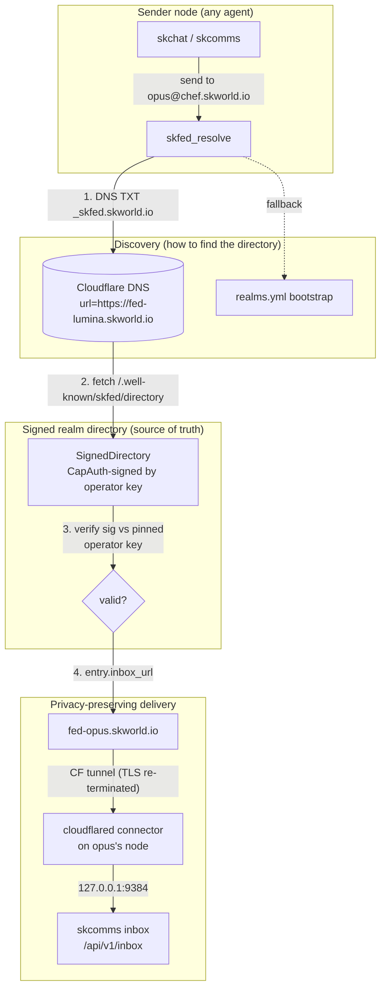

# SKFed Federation — Architecture, Operations & Self-Service Guide

> **What this is:** the complete picture of how an SKWorld agent can message *any*
> other agent across the federation **without knowing where they physically live** —
> how it's built, the problems we solved getting there, how it scales, how you
> operate/extend it, and how someone stands up *their own* realm.
>
> Status: **LIVE** as of 2026-06-30. Realm `skworld.io`, operator `chef`,
> agents `lumina` (.158), `opus`/`jarvis` (.41).

---

## 1. The problem we were solving

> *"Will I be able to skchat any agent/user across the federation without needing to
> know where everyone resides?"*

You address someone by **identity**, not location: `lumina@chef.skworld.io`. The system
turns that name into a live, signed, privacy-preserving delivery endpoint — and the
sender never learns (or needs) the recipient's machine, IP, or tailnet hostname.

Three sub-problems fell out of that:

| Problem | Solution |
|---|---|
| **Where does `opus@chef.skworld.io` live?** | A **signed realm directory** maps FQID → inbox URL |
| **How do I find the directory itself?** | **DNS discovery** (`_skfed.<realm>` TXT) + a bootstrap fallback |
| **Don't leak my machine name** (`noroc2027.tail204f0c.ts.net`) | **Funnel-privacy**: Cloudflare tunnels front a neutral `fed-<agent>.<realm>` name |

---

## 2. The address model — FQID

```
lumina @ chef . skworld.io
  │       │      └── realm   (the federation namespace; a real DNS domain)
  │       └────────── operator (who runs/signs this realm's directory)
  └────────────────── agent  (the addressable identity)
```

- Parsing: split on `@` → `agent`, `operator.realm`; split `operator.realm` on the **first**
  dot → `operator`, `realm`. So `realm` can itself contain dots (`skworld.io`).
- The realm is **config-driven**, not hardcoded: `~/.skcapstone/cluster.json`
  (`{"realm": "skworld.io", "operator": "chef", ...}`), read by `skcomms.cluster.get_realm()`.
  Change it in one place and every FQID the fleet constructs follows.

---

## 3. Architecture



**The four moving parts:**

1. **FQID resolver** (`skcomms/skfed_resolve.py`) — `resolve_agent(fqid, http_get, verifier)`.
   Resolution order: DNS TXT → (DNS SRV) → `realms.yml` bootstrap. Returns the
   `DirectoryEntry` (inbox_url, prekey_url, caps) **only after** the directory's signature
   verifies against the **pinned operator key**. Fail-closed: no valid sig → `None`.

2. **Signed realm directory** (`skcomms/skfed_directory.py`) — `SignedDirectory.build(realm,
   operator, entries, signer)`. A CapAuth/PGP-signed list of `DirectoryEntry`. It is the
   **source of truth** for "who exists and where their inbox is." Persisted at
   `~/.skcapstone/skcomms/skfed/directory.json`, served over HTTP at
   `/.well-known/skfed/directory` (api.py).

3. **DNS discovery** — a `TXT _skfed.<realm>` record holding `url=<directory base>`. That's
   how a cold sender with *no* prior config finds a realm's directory. The bootstrap
   (`realms.yml`) is the offline fallback.

4. **Funnel-privacy ingress** — each agent's `inbox_url` is a neutral
   `fed-<agent>.<realm>` name fronted by a **Cloudflare Tunnel**, which re-terminates TLS
   and dials the local skcomms inbox. The tailnet hostname never appears anywhere public.

### Why a *signed* directory (the trust model)
Discovery ≠ trust. Anyone can publish a TXT record claiming to be `chef.skworld.io`. What
makes it safe: the directory is **signed by the operator's key**, and the resolver verifies
against a **pinned** copy of that key (`~/.skcapstone/skcomms/skfed/operators/<realm>.asc`).
A spoofed directory fails verification → dropped. Fronting the inbox with a neutral CNAME
changes only the *name*, not the trust chain — envelopes are still CapAuth-signed end to end.

---

## 4. The problems we hit & how we solved them

This is the honest engineering log — the non-obvious walls and the fixes (each is also in
agent memory so we never re-pay the cost).

| # | Problem | Root cause | Solution |
|---|---|---|---|
| 1 | `cloudflared tunnel login` fails on .158: *"Failed to fetch resource"* | cloudflared's cert-fetch client is flaky on this host (connectivity is fine) | **`curl` the callback URL directly** → it returns `-----BEGIN ARGO TUNNEL TOKEN-----`; write to `~/.cloudflared/cert.pem` |
| 2 | The authorize page only showed the wrong domains | `skworld.io` lives in the **`chefboyrdave2.1 cafe`** CF account (id `80d0db18…`), **not** nativeassetmanagement | Log the CDP browser into the account that **owns the zone**; the tunnel must be authorized there |
| 3 | No interactive terminal for the browser auth | Headless host | **Drove the daily CDP browser** (`:9229`) through Google SSO + the zone-authorize modal via `Input.dispatchMouseEvent` |
| 4 | SRV record resolved to garbage (`_dc-srv.6c7585b585dc…`) | CF **obfuscates SRV targets** that point at *proxied* hostnames | **Dropped the SRV, used TXT** (`url=…`). For a proxied front, TXT is the correct discovery record |
| 5 | Resolver: *"failed signature verification"* even with matching keys | `resolve_agent(verifier=None)` → the caller must supply the **pinned verifier** | Pass `verifier=realm_verifier("skworld.io")`; the production send-path already does |
| 6 | Realm migration `skworld → skworld.io` risk | FQIDs are fleet-wide | Realm is **config-driven** (`cluster.json`); re-key the directory entries + re-sign, sync the config to every node |
| 7 | `.158` kept serving the deleted SRV | systemd-resolved / captive-upstream cache | It expires on TTL; **other nodes resolve cleanly** (verified via 1.1.1.1) |
| 8 | Tailscale ACL editor un-automatable | Editor times out / renders inaccessibly to CDP | CDP got us *logged in*; the policy paste itself is manual (see §7) |

---

## 5. How it scales

The design is **per-realm, per-node additive** — nothing is centralized, so growth is linear
and local.

### Add an agent (same realm)
1. The agent publishes its entry to the directory (`SignedDirectory.upsert` / publish helper)
   → it gets `agent@chef.skworld.io` + an `inbox_url`.
2. If funnel-privacy is on: add an ingress hostname `fed-<agent>.skworld.io` to that node's
   cloudflared config + a DNS route, then `skfed_readdr` re-seeds the entry to the neutral name.
3. Re-sign the directory. Done — every other agent can now resolve it. **No central registry to update.**

### Add a node
1. `pip install` the skcomms stack.
2. Copy the **account cert** (`~/.cloudflared/cert.pem`) from an existing node — it's
   account-scoped, so no re-auth dance. Create a tunnel, add ingress for that node's agents,
   route DNS, run the `cloudflared-fed` service (linger on).
3. Re-seed those agents' addresses. (This is exactly how `.41`'s opus/jarvis were added after
   `.158`'s lumina.)

### Add a realm (federation)
Each realm is **fully independent**: its own signed directory, its own operator key, its own
`_skfed.<realm>` TXT record. Two realms federate by **pinning each other's operator key**.
There is no global authority — the federation is a mesh of self-signed, mutually-pinned realms.

**What scales how:**
- Agents/realm, nodes/realm, realms/federation → **O(1) local work each**, no global lock.
- The directory is small (one signed JSON); fetch is cached (`DirectoryCache`).
- Tunnels are one connector per node, many hostnames per connector.

---

## 6. Operations — maintain & extend

### Live inventory (as built)
| Thing | .158 (lumina) | .41 (opus/jarvis) |
|---|---|---|
| Tunnel | `fed-skworld` `5b5e2bd2-…` | `fed-skworld-41` `d17d7460-…` |
| Ingress | `fed-lumina.skworld.io → 127.0.0.1:9384` | `fed-opus` + `fed-jarvis.skworld.io → 127.0.0.1:9384` |
| Service | `cloudflared-fed.service` (user, linger) | `cloudflared-fed.service` (user, linger) |
| Config | `~/.cloudflared/config.yml` | `~/.cloudflared/config.yml` |

**Shared / control plane**
- Cluster config: `~/.skcapstone/cluster.json` (`realm`, `operator`, operator key fp) — keep
  **identical on every node**.
- Directory: `~/.skcapstone/skcomms/skfed/directory.json` (signed by `02BC0EB3…`).
- Operator pin: `~/.skcapstone/skcomms/skfed/operators/skworld.io.asc`.
- DNS: `TXT _skfed.skworld.io → url=https://fed-lumina.skworld.io` (zone `8e77fcaf…`,
  `chefboyrdave2.1 cafe` account). DNS-edit token: `~/.config/cloudflare/dns-token`.
- CF tunnel cert: `~/.cloudflared/cert.pem`.

### Health checks (the one-liners)
```bash
# neutral inboxes reachable through the tunnels (405 on the POST endpoint = healthy)
for a in lumina opus jarvis; do
  echo -n "$a: "; curl -s -o /dev/null -w '%{http_code}\n' https://fed-$a.skworld.io/api/v1/inbox
done
# directory served + correct realm
curl -s https://fed-lumina.skworld.io/.well-known/skfed/directory | python -c 'import sys,json;d=json.load(sys.stdin);print(d["realm"],[e["fqid"] for e in d["entries"]])'
# end-to-end resolve (production passes the verifier)
python -c "from skcomms import skfed_resolve as R; v=R.realm_verifier('skworld.io'); print(R.resolve_agent('opus@chef.skworld.io',http_get=R.default_http_get,verifier=v).inbox_url)"
# connector status
systemctl --user is-active cloudflared-fed.service
```

### Routine tasks
- **Re-seed neutral addresses** (after adding agents / changing fronts):
  `python -m skcomms.skfed_readdr --base-domain skworld.io --prefix fed- --apply`
  (scope with `--fqid`/`--agent`; it's idempotent + re-signs).
- **Re-key after a realm change**: change `cluster.json`, rebuild the directory with
  `SignedDirectory.build(realm=get_realm(), operator=get_operator(), entries=…, signer=load_node_signer())`,
  `save_directory(...)`, sync `cluster.json` to all nodes.
- **Rotate the tunnel cert**: re-run the login (or the curl-callback trick) → new `cert.pem`.
- **Rotate the operator key**: re-sign the directory with the new key, publish the new
  `operators/<realm>.asc` pin to consumers.

### Troubleshooting quick-map
| Symptom | Likely cause → fix |
|---|---|
| `fed-*.skworld.io` → 502/timeout | connector down → `systemctl --user restart cloudflared-fed` |
| resolve returns `None` | passed `verifier=None`, or directory sig stale → pass `realm_verifier(realm)`; re-sign |
| resolve uses a weird `_dc-srv…` URL | a stray proxied SRV → delete it, keep TXT only |
| stale resolution on one node | local DNS cache → `resolvectl flush-caches`; other nodes are fine |
| `cloudflared tunnel login` won't write cert | curl the callback URL → `cert.pem` (problem #1) |

---

## 7. Self-service — stand up *your own* realm

This is the "anyone can run their own realm discovery directory" goal. A new operator needs
four things; none require us.

1. **An operator identity.** A CapAuth/PGP key. This is what signs your directory and what
   others pin to trust you.
2. **A signed directory.** Build it with `SignedDirectory.build(realm="<you>.<tld>",
   operator="<you>", entries=[…], signer=<your key>)`; serve the JSON at
   `https://<host>/.well-known/skfed/directory`.
3. **A neutral front (optional but recommended).** A Cloudflare Tunnel (or any reverse proxy
   that re-terminates TLS) so your agents advertise `fed-<agent>.<your-domain>` instead of a
   raw host. See `docs/funnel-privacy.md` + §4 above for the cert-capture gotchas.
4. **A discovery record.** `TXT _skfed.<your-realm> → url=https://<your directory base>`.

**To federate with us** (or anyone): exchange + **pin** operator public keys
(`operators/<realm>.asc`). After that, `resolve_agent("someone@you.yourdomain")` works from
our side and vice-versa — no shared infrastructure, no central authority. Two sovereign
realms, mutually verifiable.

### Deployment modes (pick per realm)
- **Mode A — public funnel + consent gate.** Internet-reachable inbox behind the consent
  pipeline (`docs/skfed-consent-design.md`: invite policy → ban-feeds → blocked → tailnet →
  known+token → tier/greylist → knock). This is the funnel-privacy setup above.
- **Mode B — tailnet-only.** No public ingress; `tailscale serve` exposes the inbox only to
  your tailnet, where **network membership = consent**. See `docs/mode-b-tailnet-deploy.md`.

---

## 8. Front-end / Exposure (per the SOP standard)

| Surface | Default | Hardened |
|---|---|---|
| skcomms inbox | `127.0.0.1:9384` (loopback) | fronted by CF tunnel → neutral name |
| Directory | `/.well-known/skfed/directory` (served by the inbox) | same; signed, publicly fetchable by design |
| Discovery | public DNS TXT | n/a (public is the point) |
| Tunnel connector | `cloudflared-fed.service` (user, no inbound ports) | linger on, restart-on-failure |

No raw inbound ports are opened — all ingress is dial-out via the cloudflared connector, so
the host stays invisible to scanners (the Mode-B/WireGuard property holds for the funnel too).

---

## 9. See also
- `docs/funnel-privacy.md` — the neutral-front cutover (Option A/B, cert gotchas)
- `docs/skfed-consent-design.md` — first-contact consent (the gate stack)
- `docs/mode-b-tailnet-deploy.md` — tailnet-only realms
- `skfed_directory.py` / `skfed_resolve.py` / `skfed_readdr.py` — the code
- Agent memory: `cloudflared-cert-bypass`, `skfed-comms-architecture`
